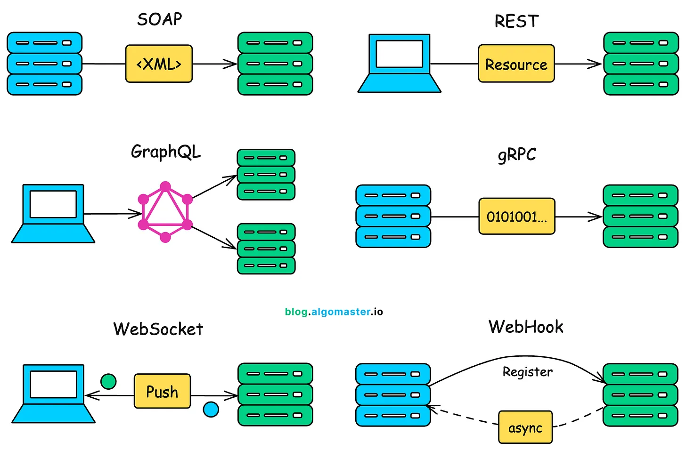

# Top 6 API Architecture Styles

## Table of Contents
- [Overview](#overview)
- [1. REST (Representational State Transfer)](#1-rest-representational-state-transfer)
- [2. GraphQL](#2-graphql)
- [3. gRPC](#3-grpc)
- [4. SOAP (Simple Object Access Protocol)](#4-soap-simple-object-access-protocol)
- [5. WebSocket](#5-websocket)
- [6. Webhook](#6-webhook)
- [Comparison Table](#comparison-table)
- [How to Choose](#how-to-choose)


---

## Overview

Modern applications use various API architecture styles depending on their requirements. Each style has specific strengths, weaknesses, and ideal use cases. Understanding these architecture patterns is crucial for building efficient, scalable systems.

**The 6 Main API Architecture Styles:**
1. **REST** - Most popular, HTTP-based, resource-oriented
2. **GraphQL** - Query language, flexible data fetching
3. **gRPC** - High-performance, binary protocol
4. **SOAP** - Enterprise-grade, XML-based, strict standards
5. **WebSocket** - Bidirectional, real-time communication
6. **Webhook** - Event-driven, server-to-server push notifications

---

## 1. REST (Representational State Transfer)

### What is REST?

REST is an architectural style for designing networked applications. It relies on stateless, client-server communication using standard HTTP methods (GET, POST, PUT, DELETE, PATCH).

### Key Principles

1. **Stateless** - Each request contains all information needed
2. **Client-Server** - Separation of concerns
3. **Cacheable** - Responses must define themselves as cacheable or not
4. **Uniform Interface** - Standardized way to interact with resources
5. **Layered System** - Architecture can be composed of hierarchical layers
6. **Resource-Based** - Everything is a resource with a unique URI

### How REST Works

```
Client                          Server
  |                               |
  |--- GET /users/123 --------→  |
  |                               | (Fetch user)
  |←-- 200 OK {user data} ------- |
  |                               |
  |--- POST /users -----------→  |
  |    {name: "John"}            | (Create user)
  |←-- 201 Created {new user} --- |
  |                               |
  |--- PUT /users/123 --------→  |
  |    {name: "Jane"}            | (Update user)
  |←-- 200 OK {updated user} ---- |
  |                               |
  |--- DELETE /users/123 ------→  |
  |                               | (Delete user)
  |←-- 204 No Content ----------- |
```

### HTTP Methods

| Method | Purpose | Idempotent | Safe |
|--------|---------|------------|------|
| **GET** | Retrieve resource | Yes | Yes |
| **POST** | Create resource | No | No |
| **PUT** | Update/Replace entire resource | Yes | No |
| **PATCH** | Partial update | No* | No |
| **DELETE** | Delete resource | Yes | No |
| **HEAD** | Get headers only | Yes | Yes |
| **OPTIONS** | Get supported methods | Yes | Yes |

### Example Implementation

#### Node.js/Express REST API

```javascript
const express = require('express');
const app = express();
app.use(express.json());

let users = [
  { id: 1, name: 'John Doe', email: 'john@example.com' },
  { id: 2, name: 'Jane Smith', email: 'jane@example.com' }
];

// GET - Retrieve all users
app.get('/api/users', (req, res) => {
  res.json({
    success: true,
    data: users,
    count: users.length
  });
});

// GET - Retrieve single user
app.get('/api/users/:id', (req, res) => {
  const user = users.find(u => u.id === parseInt(req.params.id));
  
  if (!user) {
    return res.status(404).json({
      success: false,
      error: 'User not found'
    });
  }
  
  res.json({
    success: true,
    data: user
  });
});

// POST - Create new user
app.post('/api/users', (req, res) => {
  const { name, email } = req.body;
  
  if (!name || !email) {
    return res.status(400).json({
      success: false,
      error: 'Name and email are required'
    });
  }
  
  const newUser = {
    id: users.length + 1,
    name,
    email
  };
  
  users.push(newUser);
  
  res.status(201).json({
    success: true,
    data: newUser
  });
});

// PUT - Update entire user
app.put('/api/users/:id', (req, res) => {
  const user = users.find(u => u.id === parseInt(req.params.id));
  
  if (!user) {
    return res.status(404).json({
      success: false,
      error: 'User not found'
    });
  }
  
  user.name = req.body.name;
  user.email = req.body.email;
  
  res.json({
    success: true,
    data: user
  });
});

// PATCH - Partial update
app.patch('/api/users/:id', (req, res) => {
  const user = users.find(u => u.id === parseInt(req.params.id));
  
  if (!user) {
    return res.status(404).json({
      success: false,
      error: 'User not found'
    });
  }
  
  if (req.body.name) user.name = req.body.name;
  if (req.body.email) user.email = req.body.email;
  
  res.json({
    success: true,
    data: user
  });
});

// DELETE - Remove user
app.delete('/api/users/:id', (req, res) => {
  const index = users.findIndex(u => u.id === parseInt(req.params.id));
  
  if (index === -1) {
    return res.status(404).json({
      success: false,
      error: 'User not found'
    });
  }
  
  users.splice(index, 1);
  
  res.status(204).send();
});

app.listen(3000, () => console.log('REST API running on port 3000'));
```

#### Client-Side Usage

```javascript
// GET Request
fetch('http://api.example.com/users')
  .then(res => res.json())
  .then(data => console.log(data));

// POST Request
fetch('http://api.example.com/users', {
  method: 'POST',
  headers: {
    'Content-Type': 'application/json',
    'Authorization': 'Bearer token123'
  },
  body: JSON.stringify({
    name: 'John Doe',
    email: 'john@example.com'
  })
})
  .then(res => res.json())
  .then(data => console.log(data));

// PUT Request
fetch('http://api.example.com/users/123', {
  method: 'PUT',
  headers: { 'Content-Type': 'application/json' },
  body: JSON.stringify({
    name: 'Jane Doe',
    email: 'jane@example.com'
  })
})
  .then(res => res.json())
  .then(data => console.log(data));

// DELETE Request
fetch('http://api.example.com/users/123', {
  method: 'DELETE'
})
  .then(res => console.log('Deleted'));
```

### When to Use REST

✅ **Use REST when:**
- Building public APIs for web/mobile apps
- CRUD operations are primary use case
- Caching is important
- Need stateless communication
- Wide client compatibility required
- Simple, predictable API structure needed
- Following industry standards is important

❌ **Avoid REST when:**
- Need real-time bidirectional communication
- Complex queries with nested relationships
- Need to minimize data transfer
- High-performance, low-latency required
- Binary data transmission is primary use case

### Pros

✅ **Simple & Intuitive** - Easy to understand and implement  
✅ **Ubiquitous** - Widest adoption, most documentation available  
✅ **Cacheable** - Built-in HTTP caching support  
✅ **Stateless** - Scalable, no server-side session management  
✅ **Platform Independent** - Works with any language/framework  
✅ **Tooling** - Extensive tools for testing, documentation (Swagger/OpenAPI)  
✅ **HTTP Standards** - Leverages existing HTTP infrastructure  
✅ **SEO Friendly** - Works well with search engines  

### Cons

❌ **Over-fetching** - Gets more data than needed  
❌ **Under-fetching** - May need multiple requests for related data  
❌ **Multiple Round Trips** - N+1 problem for nested resources  
❌ **Versioning Complexity** - API versioning can be challenging  
❌ **No Real-time** - Not designed for live updates  
❌ **Rigid Structure** - Endpoints define data shape  
❌ **Bandwidth** - Can transfer unnecessary data  

### REST Best Practices

```javascript
// 1. Use nouns for resources, not verbs
✅ GET /users
❌ GET /getUsers

// 2. Use plural nouns
✅ GET /users/123
❌ GET /user/123

// 3. Use HTTP methods correctly
✅ DELETE /users/123
❌ POST /users/delete/123

// 4. Use proper status codes
// 200 OK - Success
// 201 Created - Resource created
// 204 No Content - Success, no body
// 400 Bad Request - Client error
// 401 Unauthorized - Authentication required
// 403 Forbidden - No permission
// 404 Not Found - Resource doesn't exist
// 500 Internal Server Error - Server error

// 5. Version your API
✅ /api/v1/users
✅ /api/v2/users

// 6. Use filtering, sorting, pagination
GET /users?status=active&sort=name&page=2&limit=20

// 7. Use nested resources logically
GET /users/123/posts
GET /users/123/posts/456

// 8. Return consistent response format
{
  "success": true,
  "data": { ... },
  "error": null,
  "meta": {
    "page": 1,
    "limit": 20,
    "total": 100
  }
}
```

---

## 2. GraphQL

### What is GraphQL?

GraphQL is a query language for APIs and a runtime for executing those queries with your existing data. Created by Facebook in 2012, open-sourced in 2015.

### Key Concepts

1. **Single Endpoint** - Typically `/graphql`
2. **Strong Typing** - Schema defines types and relationships
3. **Client-Specified Queries** - Clients request exactly what they need
4. **No Over/Under-fetching** - Get precisely the data you want
5. **Introspection** - Schema is self-documenting

### How GraphQL Works

```
Client                                  Server
  |                                       |
  |--- POST /graphql ---------------→    |
  |    query {                           |
  |      user(id: "123") {              |
  |        name                          |
  |        email                         |
  |        posts {                       |
  |          title                       |
  |        }                             |
  |      }                               |
  |    }                                 |
  |                                      | (Single query,
  |←--- 200 OK -----------------------   |  multiple resources)
  |    {                                 |
  |      "data": {                       |
  |        "user": {                     |
  |          "name": "John",            |
  |          "email": "j@ex.com",      |
  |          "posts": [...]            |
  |        }                            |
  |      }                              |
  |    }                                |
```

### Schema Definition

```graphql
# Define types
type User {
  id: ID!
  name: String!
  email: String!
  age: Int
  posts: [Post!]!
  createdAt: String!
}

type Post {
  id: ID!
  title: String!
  content: String!
  author: User!
  comments: [Comment!]!
  published: Boolean!
}

type Comment {
  id: ID!
  text: String!
  author: User!
  post: Post!
}

# Query operations (READ)
type Query {
  user(id: ID!): User
  users(limit: Int, offset: Int): [User!]!
  post(id: ID!): Post
  posts(filter: PostFilter): [Post!]!
  searchUsers(query: String!): [User!]!
}

# Mutation operations (CREATE, UPDATE, DELETE)
type Mutation {
  createUser(input: CreateUserInput!): User!
  updateUser(id: ID!, input: UpdateUserInput!): User!
  deleteUser(id: ID!): Boolean!
  createPost(input: CreatePostInput!): Post!
}

# Subscription operations (REAL-TIME)
type Subscription {
  userCreated: User!
  postPublished: Post!
  commentAdded(postId: ID!): Comment!
}

# Input types
input CreateUserInput {
  name: String!
  email: String!
  age: Int
}

input UpdateUserInput {
  name: String
  email: String
  age: Int
}

input PostFilter {
  authorId: ID
  published: Boolean
}
```

### Example Implementation

#### Node.js with Apollo Server

```javascript
const { ApolloServer, gql } = require('apollo-server');

// Schema definition
const typeDefs = gql`
  type User {
    id: ID!
    name: String!
    email: String!
    posts: [Post!]!
  }

  type Post {
    id: ID!
    title: String!
    content: String!
    author: User!
  }

  type Query {
    users: [User!]!
    user(id: ID!): User
    posts: [Post!]!
    post(id: ID!): Post
  }

  type Mutation {
    createUser(name: String!, email: String!): User!
    createPost(userId: ID!, title: String!, content: String!): Post!
    updateUser(id: ID!, name: String, email: String): User!
    deleteUser(id: ID!): Boolean!
  }

  type Subscription {
    userCreated: User!
    postCreated: Post!
  }
`;

// Sample data
let users = [
  { id: '1', name: 'John Doe', email: 'john@example.com' },
  { id: '2', name: 'Jane Smith', email: 'jane@example.com' }
];

let posts = [
  { id: '1', title: 'GraphQL Intro', content: 'Learn GraphQL...', userId: '1' },
  { id: '2', title: 'Apollo Server', content: 'Build APIs...', userId: '1' }
];

// Resolvers - implement the schema
const resolvers = {
  Query: {
    users: () => users,
    user: (_, { id }) => users.find(u => u.id === id),
    posts: () => posts,
    post: (_, { id }) => posts.find(p => p.id === id),
  },
  
  Mutation: {
    createUser: (_, { name, email }) => {
      const newUser = {
        id: String(users.length + 1),
        name,
        email
      };
      users.push(newUser);
      pubsub.publish('USER_CREATED', { userCreated: newUser });
      return newUser;
    },
    
    createPost: (_, { userId, title, content }) => {
      const newPost = {
        id: String(posts.length + 1),
        title,
        content,
        userId
      };
      posts.push(newPost);
      return newPost;
    },
    
    updateUser: (_, { id, name, email }) => {
      const user = users.find(u => u.id === id);
      if (!user) throw new Error('User not found');
      
      if (name) user.name = name;
      if (email) user.email = email;
      
      return user;
    },
    
    deleteUser: (_, { id }) => {
      const index = users.findIndex(u => u.id === id);
      if (index === -1) return false;
      
      users.splice(index, 1);
      return true;
    }
  },
  
  // Field resolvers - resolve nested data
  User: {
    posts: (user) => posts.filter(p => p.userId === user.id)
  },
  
  Post: {
    author: (post) => users.find(u => u.id === post.userId)
  },
  
  Subscription: {
    userCreated: {
      subscribe: () => pubsub.asyncIterator(['USER_CREATED'])
    }
  }
};

// Create server
const server = new ApolloServer({
  typeDefs,
  resolvers,
  context: ({ req }) => {
    // Add authentication, database, etc.
    return { user: req.user };
  }
});

server.listen(4000).then(({ url }) => {
  console.log(`GraphQL server ready at ${url}`);
});
```

#### Client-Side Queries

```javascript
// Query - fetch data
const GET_USER_QUERY = `
  query GetUser($id: ID!) {
    user(id: $id) {
      id
      name
      email
      posts {
        title
        content
      }
    }
  }
`;

fetch('http://localhost:4000/graphql', {
  method: 'POST',
  headers: {
    'Content-Type': 'application/json',
  },
  body: JSON.stringify({
    query: GET_USER_QUERY,
    variables: { id: '123' }
  })
})
  .then(res => res.json())
  .then(data => console.log(data));

// Mutation - modify data
const CREATE_USER_MUTATION = `
  mutation CreateUser($name: String!, $email: String!) {
    createUser(name: $name, email: $email) {
      id
      name
      email
    }
  }
`;

fetch('http://localhost:4000/graphql', {
  method: 'POST',
  headers: { 'Content-Type': 'application/json' },
  body: JSON.stringify({
    query: CREATE_USER_MUTATION,
    variables: {
      name: 'John Doe',
      email: 'john@example.com'
    }
  })
})
  .then(res => res.json())
  .then(data => console.log(data));
```

#### React with Apollo Client

```javascript
import { ApolloClient, InMemoryCache, useQuery, useMutation, gql } from '@apollo/client';

// Setup client
const client = new ApolloClient({
  uri: 'http://localhost:4000/graphql',
  cache: new InMemoryCache()
});

// Define query
const GET_USERS = gql`
  query GetUsers {
    users {
      id
      name
      email
      posts {
        title
      }
    }
  }
`;

// Use in component
function UserList() {
  const { loading, error, data } = useQuery(GET_USERS);

  if (loading) return <p>Loading...</p>;
  if (error) return <p>Error: {error.message}</p>;

  return (
    <ul>
      {data.users.map(user => (
        <li key={user.id}>
          {user.name} - {user.posts.length} posts
        </li>
      ))}
    </ul>
  );
}

// Mutation example
const CREATE_USER = gql`
  mutation CreateUser($name: String!, $email: String!) {
    createUser(name: $name, email: $email) {
      id
      name
      email
    }
  }
`;

function CreateUserForm() {
  const [createUser, { data, loading, error }] = useMutation(CREATE_USER);

  const handleSubmit = (e) => {
    e.preventDefault();
    createUser({
      variables: {
        name: e.target.name.value,
        email: e.target.email.value
      }
    });
  };

  return <form onSubmit={handleSubmit}>...</form>;
}
```

### When to Use GraphQL

✅ **Use GraphQL when:**
- Need flexible queries from multiple clients (web, mobile, desktop)
- Want to eliminate over/under-fetching
- Have complex, nested data relationships
- Mobile apps need to minimize data transfer
- Multiple data sources need to be aggregated
- Rapid frontend development is priority
- Need strong typing and self-documentation
- Frontend teams need autonomy from backend

❌ **Avoid GraphQL when:**
- Simple CRUD operations only
- File uploads/downloads are primary use case
- Team is unfamiliar with GraphQL
- Caching requirements are complex
- Need HTTP-level caching
- Legacy systems integration is difficult

### Pros

✅ **No Over/Under-fetching** - Get exactly what you need  
✅ **Single Request** - Fetch multiple resources in one query  
✅ **Strong Typing** - Schema validation, type safety  
✅ **Self-Documenting** - Introspection provides automatic documentation  
✅ **Flexible** - Clients control data shape  
✅ **Rapid Development** - Frontend can iterate without backend changes  
✅ **Great Developer Experience** - Tools like GraphiQL, Apollo DevTools  
✅ **Versioning Not Required** - Additive changes don't break clients  

### Cons

❌ **Complexity** - Steeper learning curve  
❌ **Caching Challenges** - Can't use simple HTTP caching  
❌ **Query Complexity** - Malicious queries can overload server  
❌ **File Uploads** - Not as straightforward as REST  
❌ **Error Handling** - Always returns 200, errors in response body  
❌ **Overhead** - More complex for simple APIs  
❌ **Rate Limiting** - Harder to implement than REST  
❌ **Monitoring** - More difficult to log and monitor  

---

## 3. gRPC

### What is gRPC?

gRPC (Google Remote Procedure Call) is a high-performance, open-source RPC framework that uses HTTP/2 and Protocol Buffers (protobuf). Created by Google.

### Key Features

1. **HTTP/2** - Multiplexing, bidirectional streaming, header compression
2. **Protocol Buffers** - Binary serialization format
3. **Code Generation** - Auto-generate client/server code
4. **Streaming** - Unary, server streaming, client streaming, bidirectional
5. **Strongly Typed** - Type-safe communication
6. **Language Agnostic** - Works across many languages

### How gRPC Works

```
Client                              Server
  |                                   |
  |--- gRPC Request (Binary) ----→   |
  |    (HTTP/2, Protobuf)            | (Process request)
  |                                   |
  |←-- gRPC Response (Binary) ----   |
  |    (Multiplexed, Compressed)     |
  |                                   |
```

### Protocol Buffers Definition

```protobuf
// user.proto
syntax = "proto3";

package user;

// Message definitions
message User {
  string id = 1;
  string name = 2;
  string email = 3;
  int32 age = 4;
  repeated string roles = 5;
}

message GetUserRequest {
  string id = 1;
}

message ListUsersRequest {
  int32 page = 1;
  int32 limit = 2;
}

message ListUsersResponse {
  repeated User users = 1;
  int32 total = 2;
}

message CreateUserRequest {
  string name = 1;
  string email = 2;
  int32 age = 3;
}

message UpdateUserRequest {
  string id = 1;
  string name = 2;
  string email = 3;
}

message DeleteUserRequest {
  string id = 1;
}

message DeleteUserResponse {
  bool success = 1;
}

message StreamUsersRequest {
  int32 batch_size = 1;
}

// Service definition
service UserService {
  // Unary RPC - simple request/response
  rpc GetUser(GetUserRequest) returns (User);
  rpc CreateUser(CreateUserRequest) returns (User);
  rpc UpdateUser(UpdateUserRequest) returns (User);
  rpc DeleteUser(DeleteUserRequest) returns (DeleteUserResponse);
  
  // Server streaming RPC - server sends stream of responses
  rpc ListUsers(ListUsersRequest) returns (stream User);
  
  // Client streaming RPC - client sends stream of requests
  rpc CreateManyUsers(stream CreateUserRequest) returns (ListUsersResponse);
  
  // Bidirectional streaming RPC
  rpc Chat(stream ChatMessage) returns (stream ChatMessage);
}

message ChatMessage {
  string user_id = 1;
  string text = 2;
  int64 timestamp = 3;
}
```

### Example Implementation

#### Node.js gRPC Server

```javascript
const grpc = require('@grpc/grpc-js');
const protoLoader = require('@grpc/proto-loader');

// Load proto file
const packageDefinition = protoLoader.loadSync('user.proto', {
  keepCase: true,
  longs: String,
  enums: String,
  defaults: true,
  oneofs: true
});

const userProto = grpc.loadPackageDefinition(packageDefinition).user;

// Sample data
const users = [
  { id: '1', name: 'John Doe', email: 'john@example.com', age: 30, roles: ['admin'] },
  { id: '2', name: 'Jane Smith', email: 'jane@example.com', age: 25, roles: ['user'] }
];

// Implement service methods
const userService = {
  // Unary RPC
  GetUser: (call, callback) => {
    const user = users.find(u => u.id === call.request.id);
    
    if (!user) {
      return callback({
        code: grpc.status.NOT_FOUND,
        message: 'User not found'
      });
    }
    
    callback(null, user);
  },
  
  CreateUser: (call, callback) => {
    const { name, email, age } = call.request;
    const newUser = {
      id: String(users.length + 1),
      name,
      email,
      age,
      roles: ['user']
    };
    
    users.push(newUser);
    callback(null, newUser);
  },
  
  UpdateUser: (call, callback) => {
    const user = users.find(u => u.id === call.request.id);
    
    if (!user) {
      return callback({
        code: grpc.status.NOT_FOUND,
        message: 'User not found'
      });
    }
    
    if (call.request.name) user.name = call.request.name;
    if (call.request.email) user.email = call.request.email;
    
    callback(null, user);
  },
  
  DeleteUser: (call, callback) => {
    const index = users.findIndex(u => u.id === call.request.id);
    
    if (index === -1) {
      return callback({
        code: grpc.status.NOT_FOUND,
        message: 'User not found'
      });
    }
    
    users.splice(index, 1);
    callback(null, { success: true });
  },
  
  // Server streaming RPC
  ListUsers: (call) => {
    users.forEach(user => {
      call.write(user);
    });
    call.end();
  },
  
  // Client streaming RPC
  CreateManyUsers: (call, callback) => {
    const newUsers = [];
    
    call.on('data', (request) => {
      const newUser = {
        id: String(users.length + newUsers.length + 1),
        name: request.name,
        email: request.email,
        age: request.age,
        roles: ['user']
      };
      newUsers.push(newUser);
    });
    
    call.on('end', () => {
      users.push(...newUsers);
      callback(null, {
        users: newUsers,
        total: newUsers.length
      });
    });
  },
  
  // Bidirectional streaming RPC
  Chat: (call) => {
    call.on('data', (message) => {
      console.log('Received:', message);
      
      // Echo back
      call.write({
        user_id: 'server',
        text: `Echo: ${message.text}`,
        timestamp: Date.now()
      });
    });
    
    call.on('end', () => {
      call.end();
    });
  }
};

// Create and start server
const server = new grpc.Server();
server.addService(userProto.UserService.service, userService);

server.bindAsync(
  '0.0.0.0:50051',
  grpc.ServerCredentials.createInsecure(),
  (err, port) => {
    if (err) {
      console.error(err);
      return;
    }
    console.log(`gRPC server running on port ${port}`);
    server.start();
  }
);
```

#### Node.js gRPC Client

```javascript
const grpc = require('@grpc/grpc-js');
const protoLoader = require('@grpc/proto-loader');

// Load proto file
const packageDefinition = protoLoader.loadSync('user.proto', {
  keepCase: true,
  longs: String,
  enums: String,
  defaults: true,
  oneofs: true
});

const userProto = grpc.loadPackageDefinition(packageDefinition).user;

// Create client
const client = new userProto.UserService(
  'localhost:50051',
  grpc.credentials.createInsecure()
);

// Unary RPC call
client.GetUser({ id: '1' }, (err, response) => {
  if (err) {
    console.error('Error:', err.message);
    return;
  }
  console.log('User:', response);
});

// Create user
client.CreateUser(
  { name: 'Bob', email: 'bob@example.com', age: 35 },
  (err, response) => {
    if (err) {
      console.error('Error:', err.message);
      return;
    }
    console.log('Created user:', response);
  }
);

// Server streaming
const call = client.ListUsers({ page: 1, limit: 10 });

call.on('data', (user) => {
  console.log('Received user:', user);
});

call.on('end', () => {
  console.log('Stream ended');
});

call.on('error', (err) => {
  console.error('Stream error:', err);
});

// Client streaming
const createMany = client.CreateManyUsers((err, response) => {
  if (err) {
    console.error('Error:', err);
    return;
  }
  console.log('Created users:', response);
});

createMany.write({ name: 'User1', email: 'user1@ex.com', age: 25 });
createMany.write({ name: 'User2', email: 'user2@ex.com', age: 30 });
createMany.write({ name: 'User3', email: 'user3@ex.com', age: 35 });
createMany.end();

// Bidirectional streaming
const chat = client.Chat();

chat.on('data', (message) => {
  console.log('Received:', message);
});

chat.write({ user_id: 'client1', text: 'Hello', timestamp: Date.now() });
chat.write({ user_id: 'client1', text: 'How are you?', timestamp: Date.now() });

setTimeout(() => {
  chat.end();
}, 5000);
```

### When to Use gRPC

✅ **Use gRPC when:**
- Microservices communication (service-to-service)
- High-performance, low-latency requirements
- Real-time streaming needed
- Polyglot environments (multiple languages)
- Internal APIs (not browser-facing)
- Strong typing is important
- Need efficient binary protocol
- Mobile clients with limited bandwidth

❌ **Avoid gRPC when:**
- Need browser support (limited browser compatibility)
- Building public REST APIs
- Human-readable messages required for debugging
- Team unfamiliar with Protocol Buffers
- Legacy systems can't use HTTP/2
- Simple CRUD APIs

### Pros

✅ **High Performance** - Binary protocol, much faster than JSON  
✅ **Efficient** - Smaller payload size, less bandwidth  
✅ **HTTP/2** - Multiplexing, bidirectional streaming  
✅ **Strongly Typed** - Type safety, compile-time checks  
✅ **Code Generation** - Auto-generate client/server code  
✅ **Streaming** - Built-in support for all streaming types  
✅ **Language Agnostic** - Works across many languages  
✅ **Deadlines/Timeouts** - Built-in timeout support  

### Cons

❌ **Browser Support** - Limited, requires gRPC-Web proxy  
❌ **Human Readability** - Binary format, harder to debug  
❌ **Learning Curve** - More complex than REST  
❌ **Tooling** - Less mature than REST tooling  
❌ **External APIs** - Not ideal for public APIs  
❌ **File Size** - Proto files add complexity  
❌ **Caching** - Can't leverage HTTP caching  

---

## 4. SOAP (Simple Object Access Protocol)

### What is SOAP?

SOAP is a protocol for exchanging structured information in web services using XML. It's a W3C standard that emphasizes extensibility, neutrality, and independence.

### Key Characteristics

1. **XML-Based** - All messages in XML format
2. **Protocol-Independent** - Can use HTTP, SMTP, TCP, etc.
3. **WSDL** - Web Service Description Language for service definition
4. **Strict Standards** - WS-Security, WS-AtomicTransaction, etc.
5. **Built-in Error Handling** - Standardized fault handling
6. **Stateful/Stateless** - Supports both

### SOAP Message Structure

```xml
<?xml version="1.0"?>
<soap:Envelope xmlns:soap="http://www.w3.org/2003/05/soap-envelope">
  
  <!-- Optional Header -->
  <soap:Header>
    <auth:Authentication xmlns:auth="http://example.com/auth">
      <auth:Username>user123</auth:Username>
      <auth:Password>pass123</auth:Password>
    </auth:Authentication>
  </soap:Header>
  
  <!-- Required Body -->
  <soap:Body>
    <m:GetUser xmlns:m="http://example.com/users">
      <m:UserId>123</m:UserId>
    </m:GetUser>
  </soap:Body>
  
</soap:Envelope>
```

### WSDL Definition

```xml
<?xml version="1.0" encoding="UTF-8"?>
<definitions xmlns="http://schemas.xmlsoap.org/wsdl/"
             xmlns:soap="http://schemas.xmlsoap.org/wsdl/soap/"
             xmlns:tns="http://example.com/users"
             xmlns:xsd="http://www.w3.org/2001/XMLSchema"
             targetNamespace="http://example.com/users">

  <!-- Types -->
  <types>
    <xsd:schema targetNamespace="http://example.com/users">
      <xsd:element name="GetUserRequest">
        <xsd:complexType>
          <xsd:sequence>
            <xsd:element name="userId" type="xsd:string"/>
          </xsd:sequence>
        </xsd:complexType>
      </xsd:element>
      
      <xsd:element name="GetUserResponse">
        <xsd:complexType>
          <xsd:sequence>
            <xsd:element name="id" type="xsd:string"/>
            <xsd:element name="name" type="xsd:string"/>
            <xsd:element name="email" type="xsd:string"/>
          </xsd:sequence>
        </xsd:complexType>
      </xsd:element>
    </xsd:schema>
  </types>

  <!-- Messages -->
  <message name="GetUserRequest">
    <part name="parameters" element="tns:GetUserRequest"/>
  </message>
  
  <message name="GetUserResponse">
    <part name="parameters" element="tns:GetUserResponse"/>
  </message>

  <!-- Port Type (Interface) -->
  <portType name="UserServicePortType">
    <operation name="GetUser">
      <input message="tns:GetUserRequest"/>
      <output message="tns:GetUserResponse"/>
    </operation>
  </portType>

  <!-- Binding -->
  <binding name="UserServiceBinding" type="tns:UserServicePortType">
    <soap:binding transport="http://schemas.xmlsoap.org/soap/http"/>
    <operation name="GetUser">
      <soap:operation soapAction="http://example.com/GetUser"/>
      <input>
        <soap:body use="literal"/>
      </input>
      <output>
        <soap:body use="literal"/>
      </output>
    </operation>
  </binding>

  <!-- Service -->
  <service name="UserService">
    <port name="UserServicePort" binding="tns:UserServiceBinding">
      <soap:address location="http://example.com/userservice"/>
    </port>
  </service>

</definitions>
```

### Example Implementation

#### Node.js SOAP Server

```javascript
const soap = require('soap');
const express = require('express');
const app = express();

// Sample data
const users = [
  { id: '1', name: 'John Doe', email: 'john@example.com' },
  { id: '2', name: 'Jane Smith', email: 'jane@example.com' }
];

// Service implementation
const service = {
  UserService: {
    UserServiceSoap: {
      GetUser: function(args) {
        const user = users.find(u => u.id === args.userId);
        if (!user) {
          throw {
            Fault: {
              Code: {
                Value: 'soap:Sender',
                Subcode: { value: 'UserNotFound' }
              },
              Reason: { Text: 'User not found' }
            }
          };
        }
        return { id: user.id, name: user.name, email: user.email };
      },
      
      CreateUser: function(args) {
        const newUser = {
          id: String(users.length + 1),
          name: args.name,
          email: args.email
        };
        users.push(newUser);
        return newUser;
      },
      
      ListUsers: function(args) {
        return { users: users };
      }
    }
  }
};

// WSDL XML definition
const xml = `
  <definitions xmlns="http://schemas.xmlsoap.org/wsdl/"
               xmlns:soap="http://schemas.xmlsoap.org/wsdl/soap/"
               xmlns:tns="http://example.com/users"
               targetNamespace="http://example.com/users">
    
    <types>
      <schema xmlns="http://www.w3.org/2001/XMLSchema"
              targetNamespace="http://example.com/users">
        <element name="GetUserRequest">
          <complexType>
            <sequence>
              <element name="userId" type="string"/>
            </sequence>
          </complexType>
        </element>
        <element name="GetUserResponse">
          <complexType>
            <sequence>
              <element name="id" type="string"/>
              <element name="name" type="string"/>
              <element name="email" type="string"/>
            </sequence>
          </complexType>
        </element>
      </schema>
    </types>

    <message name="GetUserRequest">
      <part name="parameters" element="tns:GetUserRequest"/>
    </message>
    <message name="GetUserResponse">
      <part name="parameters" element="tns:GetUserResponse"/>
    </message>

    <portType name="UserServicePortType">
      <operation name="GetUser">
        <input message="tns:GetUserRequest"/>
        <output message="tns:GetUserResponse"/>
      </operation>
    </portType>

    <binding name="UserServiceSoap" type="tns:UserServicePortType">
      <soap:binding transport="http://schemas.xmlsoap.org/soap/http"/>
      <operation name="GetUser">
        <soap:operation soapAction="GetUser"/>
        <input><soap:body use="literal"/></input>
        <output><soap:body use="literal"/></output>
      </operation>
    </binding>

    <service name="UserService">
      <port name="UserServiceSoap" binding="tns:UserServiceSoap">
        <soap:address location="http://localhost:8000/wsdl"/>
      </port>
    </service>
  </definitions>
`;

// Start SOAP service
app.listen(8000, function() {
  soap.listen(app, '/wsdl', service, xml);
  console.log('SOAP service running at http://localhost:8000/wsdl?wsdl');
});
```

#### SOAP Client

```javascript
const soap = require('soap');

const url = 'http://localhost:8000/wsdl?wsdl';

soap.createClient(url, function(err, client) {
  if (err) {
    console.error('Error creating client:', err);
    return;
  }

  // Call GetUser
  client.GetUser({ userId: '1' }, function(err, result) {
    if (err) {
      console.error('Error:', err);
      return;
    }
    console.log('User:', result);
  });

  // Call CreateUser
  client.CreateUser(
    { name: 'Bob Smith', email: 'bob@example.com' },
    function(err, result) {
      if (err) {
        console.error('Error:', err);
        return;
      }
      console.log('Created:', result);
    }
  );
});
```

### When to Use SOAP

✅ **Use SOAP when:**
- Enterprise applications with strict security requirements
- Need ACID-compliant transactions
- Legacy system integration required
- Formal contracts (WSDL) are important
- Banking, financial, or government systems
- Need built-in retry logic and error handling
- Stateful operations required
- WS-* standards compliance necessary

❌ **Avoid SOAP when:**
- Building modern web/mobile apps
- Need lightweight, fast APIs
- Public-facing consumer APIs
- Microservices architecture
- Need human-readable formats
- Simple CRUD operations

### Pros

✅ **Enterprise Standards** - Comprehensive WS-* standards  
✅ **Security** - Built-in WS-Security  
✅ **ACID Transactions** - Supports complex transactions  
✅ **Language/Platform Neutral** - Works everywhere  
✅ **Formal Contract** - WSDL provides clear API definition  
✅ **Error Handling** - Standardized fault handling  
✅ **Extensibility** - Supports custom headers and extensions  
✅ **Transport Flexibility** - Not limited to HTTP  

### Cons

❌ **Complexity** - Verbose, steep learning curve  
❌ **Performance** - XML parsing overhead, larger payloads  
❌ **Overhead** - Heavy protocol, more bandwidth  
❌ **Development Speed** - Slower development cycle  
❌ **Tooling** - Less modern tooling than REST/GraphQL  
❌ **Not Human-Readable** - Difficult to read/debug  
❌ **Overkill** - Too complex for simple APIs  

---

## 5. WebSocket

### What is WebSocket?

WebSocket is a protocol providing full-duplex communication channels over a single TCP connection. It enables real-time, bidirectional communication between client and server.

### Key Features

1. **Persistent Connection** - Single long-lived connection
2. **Bidirectional** - Client ↔ Server communication
3. **Low Latency** - No HTTP overhead per message
4. **Real-time** - Instant message delivery
5. **Event-Driven** - Push and receive events

### How WebSocket Works

```
Client                              Server
  |                                   |
  |--- HTTP Upgrade Request ------→  |
  |    (Upgrade: websocket)          |
  |                                   |
  |←-- HTTP 101 Switching Protocols  |
  |                                   |
  |════════ WebSocket Open ═══════════|
  |                                   |
  |--- Message -------------------→  |
  |←-- Message ------------------    |
  |--- Message -------------------→  |
  |←-- Message ------------------    |
  |                                   |
  |═══════ Persistent Connection ════|
```

### Handshake Process

```http
# Client Request
GET /chat HTTP/1.1
Host: example.com
Upgrade: websocket
Connection: Upgrade
Sec-WebSocket-Key: dGhlIHNhbXBsZSBub25jZQ==
Sec-WebSocket-Version: 13

# Server Response
HTTP/1.1 101 Switching Protocols
Upgrade: websocket
Connection: Upgrade
Sec-WebSocket-Accept: s3pPLMBiTxaQ9kYGzzhZRbK+xOo=
```

### Example Implementation

#### Node.js WebSocket Server (using ws library)

```javascript
const WebSocket = require('ws');
const http = require('http');

// Create HTTP server
const server = http.createServer();

// Create WebSocket server
const wss = new WebSocket.Server({ server });

// Store connected clients
const clients = new Map();

// Handle new connections
wss.on('connection', (ws, req) => {
  const clientId = Math.random().toString(36).substr(2, 9);
  clients.set(clientId, ws);
  
  console.log(`Client ${clientId} connected`);
  console.log(`Total clients: ${clients.size}`);

  // Send welcome message
  ws.send(JSON.stringify({
    type: 'welcome',
    clientId: clientId,
    message: 'Connected to WebSocket server'
  }));

  // Handle incoming messages
  ws.on('message', (data) => {
    try {
      const message = JSON.parse(data);
      console.log(`Received from ${clientId}:`, message);

      // Handle different message types
      switch (message.type) {
        case 'chat':
          // Broadcast to all clients
          broadcast({
            type: 'chat',
            clientId: clientId,
            text: message.text,
            timestamp: Date.now()
          });
          break;

        case 'private':
          // Send to specific client
          const targetClient = clients.get(message.targetId);
          if (targetClient && targetClient.readyState === WebSocket.OPEN) {
            targetClient.send(JSON.stringify({
              type: 'private',
              from: clientId,
              text: message.text,
              timestamp: Date.now()
            }));
          }
          break;

        case 'ping':
          // Respond with pong
          ws.send(JSON.stringify({
            type: 'pong',
            timestamp: Date.now()
          }));
          break;

        default:
          ws.send(JSON.stringify({
            type: 'error',
            message: 'Unknown message type'
          }));
      }
    } catch (error) {
      console.error('Error parsing message:', error);
      ws.send(JSON.stringify({
        type: 'error',
        message: 'Invalid JSON'
      }));
    }
  });

  // Handle client disconnect
  ws.on('close', () => {
    console.log(`Client ${clientId} disconnected`);
    clients.delete(clientId);
    
    // Notify others
    broadcast({
      type: 'user-left',
      clientId: clientId,
      timestamp: Date.now()
    });
  });

  // Handle errors
  ws.on('error', (error) => {
    console.error(`Error with client ${clientId}:`, error);
  });

  // Send periodic heartbeat
  const heartbeat = setInterval(() => {
    if (ws.readyState === WebSocket.OPEN) {
      ws.send(JSON.stringify({
        type: 'heartbeat',
        timestamp: Date.now()
      }));
    } else {
      clearInterval(heartbeat);
    }
  }, 30000);
});

// Broadcast to all connected clients
function broadcast(message) {
  const data = JSON.stringify(message);
  clients.forEach((client) => {
    if (client.readyState === WebSocket.OPEN) {
      client.send(data);
    }
  });
}

// Start server
const PORT = 8080;
server.listen(PORT, () => {
  console.log(`WebSocket server running on port ${PORT}`);
});
```

#### WebSocket Client (Browser)

```javascript
// Create WebSocket connection
const ws = new WebSocket('ws://localhost:8080');

// Connection opened
ws.addEventListener('open', (event) => {
  console.log('Connected to WebSocket server');
  
  // Send initial message
  ws.send(JSON.stringify({
    type: 'chat',
    text: 'Hello Server!'
  }));
});

// Listen for messages
ws.addEventListener('message', (event) => {
  try {
    const message = JSON.parse(event.data);
    console.log('Received:', message);
    
    // Handle different message types
    switch (message.type) {
      case 'welcome':
        console.log('Welcome message:', message.message);
        console.log('My client ID:', message.clientId);
        break;
        
      case 'chat':
        displayChatMessage(message);
        break;
        
      case 'private':
        displayPrivateMessage(message);
        break;
        
      case 'heartbeat':
        // Respond to heartbeat
        console.log('Heartbeat received');
        break;
        
      case 'error':
        console.error('Server error:', message.message);
        break;
    }
  } catch (error) {
    console.error('Error parsing message:', error);
  }
});

// Handle connection close
ws.addEventListener('close', (event) => {
  console.log('Disconnected from server');
  // Attempt reconnection
  setTimeout(() => {
    console.log('Attempting to reconnect...');
    // Create new connection
  }, 3000);
});

// Handle errors
ws.addEventListener('error', (error) => {
  console.error('WebSocket error:', error);
});

// Send chat message
function sendChatMessage(text) {
  if (ws.readyState === WebSocket.OPEN) {
    ws.send(JSON.stringify({
      type: 'chat',
      text: text
    }));
  } else {
    console.error('WebSocket is not open');
  }
}

// Send private message
function sendPrivateMessage(targetId, text) {
  if (ws.readyState === WebSocket.OPEN) {
    ws.send(JSON.stringify({
      type: 'private',
      targetId: targetId,
      text: text
    }));
  }
}

// Close connection
function disconnect() {
  ws.close();
}

// Display messages (example)
function displayChatMessage(message) {
  const chatBox = document.getElementById('chat');
  const messageElement = document.createElement('div');
  messageElement.textContent = `${message.clientId}: ${message.text}`;
  chatBox.appendChild(messageElement);
}

function displayPrivateMessage(message) {
  const chatBox = document.getElementById('chat');
  const messageElement = document.createElement('div');
  messageElement.style.color = 'blue';
  messageElement.textContent = `[Private from ${message.from}]: ${message.text}`;
  chatBox.appendChild(messageElement);
}
```

#### React WebSocket Hook

```javascript
import { useEffect, useRef, useState } from 'react';

function useWebSocket(url) {
  const [isConnected, setIsConnected] = useState(false);
  const [messages, setMessages] = useState([]);
  const wsRef = useRef(null);

  useEffect(() => {
    // Create WebSocket connection
    const ws = new WebSocket(url);
    wsRef.current = ws;

    ws.onopen = () => {
      console.log('Connected');
      setIsConnected(true);
    };

    ws.onmessage = (event) => {
      try {
        const message = JSON.parse(event.data);
        setMessages(prev => [...prev, message]);
      } catch (error) {
        console.error('Parse error:', error);
      }
    };

    ws.onclose = () => {
      console.log('Disconnected');
      setIsConnected(false);
    };

    ws.onerror = (error) => {
      console.error('WebSocket error:', error);
    };

    // Cleanup on unmount
    return () => {
      ws.close();
    };
  }, [url]);

  const sendMessage = (message) => {
    if (wsRef.current && wsRef.current.readyState === WebSocket.OPEN) {
      wsRef.current.send(JSON.stringify(message));
    } else {
      console.error('WebSocket not open');
    }
  };

  return { isConnected, messages, sendMessage };
}

// Usage
function ChatApp() {
  const { isConnected, messages, sendMessage } = useWebSocket('ws://localhost:8080');
  const [inputText, setInputText] = useState('');

  const handleSend = () => {
    sendMessage({
      type: 'chat',
      text: inputText
    });
    setInputText('');
  };

  return (
    <div>
      <div>Status: {isConnected ? 'Connected' : 'Disconnected'}</div>
      
      <div>
        {messages.map((msg, idx) => (
          <div key={idx}>
            {msg.type === 'chat' && `${msg.clientId}: ${msg.text}`}
          </div>
        ))}
      </div>
      
      <input
        value={inputText}
        onChange={(e) => setInputText(e.target.value)}
        onKeyPress={(e) => e.key === 'Enter' && handleSend()}
      />
      <button onClick={handleSend}>Send</button>
    </div>
  );
}
```

### When to Use WebSocket

✅ **Use WebSocket when:**
- Real-time chat applications
- Live multiplayer games
- Collaborative editing (Google Docs style)
- Live sports scores/dashboards
- Stock tickers with frequent updates
- Real-time notifications
- IoT device communication
- Live streaming data
- Any bidirectional real-time communication

❌ **Avoid WebSocket when:**
- Simple request/response is sufficient
- One-way communication only (use SSE instead)
- Infrequent updates (polling is fine)
- Need HTTP caching
- Need load balancing (more complex with WebSocket)
- Browser compatibility is limited

### Pros

✅ **Real-Time** - Instant bidirectional communication  
✅ **Low Latency** - No HTTP request/response overhead  
✅ **Efficient** - Single persistent connection  
✅ **Push & Pull** - Server and client can both initiate  
✅ **Reduced Overhead** - No headers per message after handshake  
✅ **Binary Support** - Can send text or binary data  
✅ **Browser Support** - Native browser support  
✅ **Scalable** - For real-time use cases  

### Cons

❌ **Stateful** - Connection state must be maintained  
❌ **Scaling Challenges** - Load balancing is complex  
❌ **No Auto Reconnect** - Must implement manually  
❌ **Firewall Issues** - Some proxies/firewalls block WebSockets  
❌ **Resource Intensive** - Maintains open connections  
❌ **No HTTP Benefits** - Can't use HTTP caching, CDNs  
❌ **Complexity** - More complex than REST  
❌ **Mobile Battery** - Can drain battery faster  

---

## 6. Webhook

### What is Webhook?

A webhook is a user-defined HTTP callback that's triggered by specific events. Instead of constantly polling for changes, webhooks push data to your application when events occur.

### Key Concepts

1. **Event-Driven** - Triggered by specific events
2. **Server-to-Server** - Push notifications between servers
3. **Asynchronous** - Non-blocking communication
4. **HTTP-Based** - Standard HTTP POST requests
5. **Payload Delivery** - Event data sent as JSON/XML

### How Webhooks Work

```
Your Server          Event Source          Webhook
    |                     |                   |
    |-- Register URL --→  |                   |
    |    (webhook.com/hook)|                   |
    |                     |                   |
    |                     | [Event Occurs]   |
    |                     |                   |
    |                     |-- POST --------→  |
    |                     |   {event data}   |
    |                     |                   |
    |←--------------------|-- 200 OK -----   |
    |   Process event     |                   |
```

### Webhook vs Polling

```
# Polling (Inefficient)
Client → Server: "Any updates?"
Server → Client: "Nope"
... wait 5 seconds ...
Client → Server: "Any updates?"
Server → Client: "Nope"
... wait 5 seconds ...
Client → Server: "Any updates?"
Server → Client: "Yes! Here's data"

# Webhook (Efficient)
Client → Server: "Call me at this URL when something happens"
Server: "OK"
... event occurs ...
Server → Client: "Here's the data!" [HTTP POST]
```

### Example Implementation

#### Webhook Provider (Event Source)

```javascript
const express = require('express');
const axios = require('axios');
const app = express();

app.use(express.json());

// Store registered webhooks
const webhooks = [];

// Register webhook endpoint
app.post('/webhooks/register', (req, res) => {
  const { url, events } = req.body;

  if (!url || !events || !Array.isArray(events)) {
    return res.status(400).json({
      success: false,
      error: 'URL and events array required'
    });
  }

  const webhook = {
    id: Math.random().toString(36).substr(2, 9),
    url,
    events,
    secret: Math.random().toString(36).substr(2, 16),
    createdAt: new Date()
  };

  webhooks.push(webhook);

  res.status(201).json({
    success: true,
    data: webhook
  });
});

// List webhooks
app.get('/webhooks', (req, res) => {
  res.json({
    success: true,
    data: webhooks
  });
});

// Delete webhook
app.delete('/webhooks/:id', (req, res) => {
  const index = webhooks.findIndex(w => w.id === req.params.id);

  if (index === -1) {
    return res.status(404).json({
      success: false,
      error: 'Webhook not found'
    });
  }

  webhooks.splice(index, 1);

  res.status(204).send();
});

// Trigger webhook (when event occurs)
async function triggerWebhooks(eventType, payload) {
  const relevantWebhooks = webhooks.filter(w =>
    w.events.includes(eventType)
  );

  console.log(`Triggering ${relevantWebhooks.length} webhooks for ${eventType}`);

  const promises = relevantWebhooks.map(async (webhook) => {
    try {
      const response = await axios.post(
        webhook.url,
        {
          event: eventType,
          data: payload,
          timestamp: new Date().toISOString(),
          webhookId: webhook.id
        },
        {
          headers: {
            'Content-Type': 'application/json',
            'X-Webhook-Signature': generateSignature(payload, webhook.secret)
          },
          timeout: 5000
        }
      );

      console.log(`Webhook ${webhook.id} delivered successfully`);
      return { success: true, webhookId: webhook.id };

    } catch (error) {
      console.error(`Webhook ${webhook.id} failed:`, error.message);
      
      // Implement retry logic
      await retryWebhook(webhook, eventType, payload);
      
      return { success: false, webhookId: webhook.id, error: error.message };
    }
  });

  return Promise.allSettled(promises);
}

// Retry logic
async function retryWebhook(webhook, eventType, payload, attempt = 1, maxAttempts = 3) {
  if (attempt > maxAttempts) {
    console.error(`Webhook ${webhook.id} failed after ${maxAttempts} attempts`);
    return;
  }

  const delay = Math.pow(2, attempt) * 1000; // Exponential backoff
  console.log(`Retrying webhook ${webhook.id} in ${delay}ms (attempt ${attempt})`);

  await new Promise(resolve => setTimeout(resolve, delay));

  try {
    await axios.post(webhook.url, {
      event: eventType,
      data: payload,
      timestamp: new Date().toISOString(),
      webhookId: webhook.id,
      attempt: attempt
    }, {
      timeout: 5000
    });

    console.log(`Webhook ${webhook.id} delivered on retry ${attempt}`);
  } catch (error) {
    await retryWebhook(webhook, eventType, payload, attempt + 1, maxAttempts);
  }
}

// Generate signature for verification
function generateSignature(payload, secret) {
  const crypto = require('crypto');
  return crypto
    .createHmac('sha256', secret)
    .update(JSON.stringify(payload))
    .digest('hex');
}

// Example: User creation triggers webhook
app.post('/users', async (req, res) => {
  const { name, email } = req.body;

  const newUser = {
    id: Math.random().toString(36).substr(2, 9),
    name,
    email,
    createdAt: new Date()
  };

  // Trigger webhooks
  await triggerWebhooks('user.created', newUser);

  res.status(201).json({
    success: true,
    data: newUser
  });
});

// Example: User update triggers webhook
app.put('/users/:id', async (req, res) => {
  const user = { id: req.params.id, ...req.body };

  // Trigger webhooks
  await triggerWebhooks('user.updated', user);

  res.json({
    success: true,
    data: user
  });
});

app.listen(3000, () => {
  console.log('Webhook provider running on port 3000');
});
```

#### Webhook Consumer (Receiver)

```javascript
const express = require('express');
const crypto = require('crypto');
const app = express();

app.use(express.json());

// Webhook endpoint
app.post('/webhook/receiver', (req, res) => {
  console.log('Webhook received:', req.body);

  // Verify signature (security)
  const signature = req.headers['x-webhook-signature'];
  const secret = 'your-webhook-secret'; // Store securely

  if (!verifySignature(req.body.data, secret, signature)) {
    return res.status(401).json({
      success: false,
      error: 'Invalid signature'
    });
  }

  // Process webhook based on event type
  const { event, data, timestamp } = req.body;

  switch (event) {
    case 'user.created':
      handleUserCreated(data);
      break;

    case 'user.updated':
      handleUserUpdated(data);
      break;

    case 'user.deleted':
      handleUserDeleted(data);
      break;

    case 'payment.completed':
      handlePaymentCompleted(data);
      break;

    default:
      console.log('Unknown event type:', event);
  }

  // IMPORTANT: Always respond quickly (within 5-10 seconds)
  // Process heavy tasks asynchronously
  res.status(200).json({
    success: true,
    message: 'Webhook received'
  });

  // DO NOT do this:
  // await doHeavyProcessing(); // This could timeout
  // res.status(200).send();

  // DO this instead:
  // processInBackground(data);
  // res.status(200).send();
});

// Verify webhook signature
function verifySignature(payload, secret, receivedSignature) {
  const expectedSignature = crypto
    .createHmac('sha256', secret)
    .update(JSON.stringify(payload))
    .digest('hex');

  return crypto.timingSafeEqual(
    Buffer.from(receivedSignature),
    Buffer.from(expectedSignature)
  );
}

// Event handlers
function handleUserCreated(user) {
  console.log('New user created:', user);
  // Send welcome email
  // Update database
  // Trigger analytics
}

function handleUserUpdated(user) {
  console.log('User updated:', user);
  // Sync with external systems
}

function handleUserDeleted(user) {
  console.log('User deleted:', user);
  // Clean up related data
}

function handlePaymentCompleted(payment) {
  console.log('Payment completed:', payment);
  // Process order
  // Send confirmation email
}

// Register webhook with provider
async function registerWebhook() {
  const axios = require('axios');

  try {
    const response = await axios.post('http://provider.com/webhooks/register', {
      url: 'https://your-domain.com/webhook/receiver',
      events: ['user.created', 'user.updated', 'payment.completed']
    });

    console.log('Webhook registered:', response.data);
  } catch (error) {
    console.error('Failed to register webhook:', error);
  }
}

app.listen(4000, () => {
  console.log('Webhook receiver running on port 4000');
  // registerWebhook();
});
```

#### Real-World Examples

**GitHub Webhooks**
```javascript
// Register webhook via GitHub API
POST https://api.github.com/repos/owner/repo/hooks
{
  "name": "web",
  "active": true,
  "events": ["push", "pull_request", "issues"],
  "config": {
    "url": "https://your-server.com/webhook",
    "content_type": "json",
    "secret": "your-secret-key"
  }
}

// Receive webhook
app.post('/webhook/github', (req, res) => {
  const event = req.headers['x-github-event'];
  const signature = req.headers['x-hub-signature-256'];
  
  // Verify signature
  if (!verifyGitHubSignature(req.body, signature)) {
    return res.status(401).send('Unauthorized');
  }
  
  switch (event) {
    case 'push':
      // Deploy code
      deployCode(req.body);
      break;
    case 'pull_request':
      // Run CI/CD
      runTests(req.body);
      break;
  }
  
  res.status(200).send('OK');
});
```

**Stripe Webhooks**
```javascript
// Receive Stripe webhook
app.post('/webhook/stripe', express.raw({type: 'application/json'}), (req, res) => {
  const sig = req.headers['stripe-signature'];
  const webhookSecret = process.env.STRIPE_WEBHOOK_SECRET;
  
  let event;
  try {
    event = stripe.webhooks.constructEvent(req.body, sig, webhookSecret);
  } catch (err) {
    return res.status(400).send(`Webhook Error: ${err.message}`);
  }
  
  // Handle event
  switch (event.type) {
    case 'payment_intent.succeeded':
      const paymentIntent = event.data.object;
      handleSuccessfulPayment(paymentIntent);
      break;
      
    case 'payment_intent.failed':
      const failedPayment = event.data.object;
      handleFailedPayment(failedPayment);
      break;
      
    case 'customer.subscription.created':
      const subscription = event.data.object;
      handleNewSubscription(subscription);
      break;
  }
  
  res.json({received: true});
});
```

### When to Use Webhooks

✅ **Use Webhooks when:**
- Need event-driven, real-time notifications
- Want to eliminate polling overhead  
- Integrating third-party services (payment, auth, CMS)
- Building notification systems
- CI/CD pipelines (code push → deploy)
- Monitoring and alerting systems
- Synchronizing data between systems
- Triggering workflows based on events

❌ **Avoid Webhooks when:**
- Need synchronous responses
- Can't expose public endpoint
- Simple request/response is sufficient
- Events are too frequent (may overwhelm receiver)
- Need guaranteed delivery (webhooks can fail)

### Pros

✅ **Efficient** - No constant polling needed  
✅ **Real-Time** - Instant event notifications  
✅ **Scalable** - Reduces unnecessary API calls  
✅ **Decoupled** - Loose coupling between systems  
✅ **Resource Friendly** - Lower server load  
✅ **Event-Driven** - React to events as they occur  
✅ **Flexible** - Works with any HTTP-capable system  

### Cons

❌ **Delivery Not Guaranteed** - Network issues can cause failures  
❌ **No Built-in Retry** - Must implement retry logic  
❌ **Security Concerns** - Need to verify webhook authenticity  
❌ **Debugging Difficult** - Hard to trace webhook flows  
❌ **Endpoint Required** - Need publicly accessible URL  
❌ **No Response Data** - Fire-and-forget, can't get response  
❌ **Ordering Issues** - Webhooks may arrive out of order  
❌ **Rate Limiting** - Can overwhelm receiver if too frequent  

### Webhook Best Practices

```javascript
// 1. Always verify signatures
function verifyWebhook(payload, signature, secret) {
  const expectedSig = crypto
    .createHmac('sha256', secret)
    .update(JSON.stringify(payload))
    .digest('hex');
  return crypto.timingSafeEqual(Buffer.from(signature), Buffer.from(expectedSig));
}

// 2. Respond quickly (within 5-10 seconds)
app.post('/webhook', async (req, res) => {
  // Respond immediately
  res.status(200).json({ received: true });
  
  // Process asynchronously
  processWebhookAsync(req.body);
});

// 3. Implement idempotency (handle duplicates)
const processedWebhooks = new Set();

app.post('/webhook', (req, res) => {
  const webhookId = req.body.id;
  
  if (processedWebhooks.has(webhookId)) {
    return res.status(200).json({ message: 'Already processed' });
  }
  
  processWebhook(req.body);
  processedWebhooks.add(webhookId);
  
  res.status(200).send();
});

// 4. Implement retry logic with exponential backoff
async function sendWebhook(url, payload, attempt = 1) {
  const maxAttempts = 3;
  const backoff = Math.pow(2, attempt) * 1000;
  
  try {
    await axios.post(url, payload, { timeout: 5000 });
  } catch (error) {
    if (attempt < maxAttempts) {
      await new Promise(resolve => setTimeout(resolve, backoff));
      return sendWebhook(url, payload, attempt + 1);
    }
    throw error;
  }
}

// 5. Log everything
app.post('/webhook', (req, res) => {
  console.log({
    timestamp: new Date(),
    event: req.body.event,
    data: req.body.data,
    headers: req.headers
  });
  
  // Process...
  
  res.status(200).send();
});
```

---

## Comparison Table

| Feature | REST | GraphQL | gRPC | SOAP | WebSocket | Webhook |
|---------|------|---------|------|------|-----------|---------|
| **Communication** | Request-Response | Request-Response | RPC | Request-Response | Bidirectional | Server→Client Push |
| **Protocol** | HTTP | HTTP | HTTP/2 | HTTP/SMTP/TCP | WebSocket | HTTP POST |
| **Data Format** | JSON/XML | JSON | Protobuf (Binary) | XML | Text/Binary | JSON/XML |
| **Performance** | Medium | Medium | Very High | Low | High | N/A |
| **Payload Size** | Medium | Medium | Small | Large | Small | Medium |
| **Learning Curve** | Easy | Medium | Hard | Hard | Medium | Easy |
| **Real-Time** | No | Subscriptions | Streaming | No | Yes | Yes (Events) |
| **Caching** | Easy | Complex | No | No | No | No |
| **Browser Support** | Excellent | Excellent | Limited | Good | Good | N/A |
| **Tooling** | Excellent | Good | Growing | Mature | Good | Limited |
| **Use Case** | General Purpose | Complex Queries | Microservices | Enterprise | Real-Time Apps | Event Notifications |
| **Scalability** | High | Medium | Very High | Low | Medium | High |
| **State** | Stateless | Stateless | Stateless | Can be Stateful | Stateful | Stateless |
| **Versioning** | Required | Not Required | Version in Proto | Required | N/A | Versioned Events |
| **Security** | HTTPS, OAuth | HTTPS, OAuth | TLS, mTLS | WS-Security | WSS, Auth | Signature Verification |

---

## How to Choose

### Decision Tree

```
Do you need real-time bidirectional communication?
├─ YES → WebSocket
└─ NO
    │
    Do you need event-driven server-to-server notifications?
    ├─ YES → Webhook
    └─ NO
        │
        Is this for high-performance microservices (internal)?
        ├─ YES → gRPC
        └─ NO
            │
            Need enterprise-grade with strict security/transactions?
            ├─ YES → SOAP
            └─ NO
                │
                Need flexible queries with complex nested data?
                ├─ YES → GraphQL
                └─ NO → REST (Default choice)
```

### Use Case Matrix

| Use Case | Best Choice | Alternative |
|----------|-------------|-------------|
| Public API | REST | GraphQL |
| Mobile App Backend | GraphQL / REST | gRPC |
| Microservices Communication | gRPC | REST |
| Real-Time Chat | WebSocket | SSE + REST |
| Live Dashboard/Feed | WebSocket / SSE | REST Polling |
| Payment Processing | Webhook + REST | REST Polling |
| Enterprise System | SOAP | REST |
| IoT Devices | gRPC / MQTT | WebSocket |
| Social Media API | GraphQL | REST |
| Simple CRUD App | REST | Any |
| CI/CD Pipeline | Webhook | REST Polling |
| Video Streaming | WebSocket / gRPC | HLS/DASH |
| File Upload/Download | REST | gRPC |
| Search API | REST / GraphQL | Either |
| Admin Dashboard | REST / GraphQL | Either |

### Quick Recommendations

**🌐 Building a Public API?**
→ **REST** (most compatible) or **GraphQL** (if clients vary greatly)

**⚡ Need High Performance?**
→ **gRPC** (binary, fast) or **WebSocket** (real-time)

**📱 Mobile App?**
→ **GraphQL** (minimize data transfer) or **REST**

**🏢 Enterprise Integration?**
→ **SOAP** (if required by legacy systems) or **REST**

**💬 Real-Time Chat/Gaming?**
→ **WebSocket**

**🔔 Event Notifications?**
→ **Webhook** (push) or **SSE** (if server→client only)

**🔧 Microservices?**
→ **gRPC** (internal) + **REST/GraphQL** (external)

---

## Summary

Each API architecture style has its strengths and ideal use cases:

- **REST**: Default choice for most web APIs, widely supported, simple
- **GraphQL**: Flexible queries, great for complex data needs, mobile apps
- **gRPC**: High-performance microservices, internal service communication
- **SOAP**: Enterprise systems requiring strict standards and security
- **WebSocket**: Real-time bidirectional communication, chat, gaming
- **Webhook**: Event-driven notifications, integration, automation

**Choose based on:**
- Performance requirements
- Real-time needs
- Client types (browser, mobile, server)
- Team expertise
- Ecosystem and tooling
- Existing infrastructure

Most modern applications use **multiple** API styles:
- REST/GraphQL for public API
- gRPC for internal microservices
- WebSocket for real-time features  
- Webhooks for external integrations

There's no "best" architecture—only the right one for your specific needs! 🚀