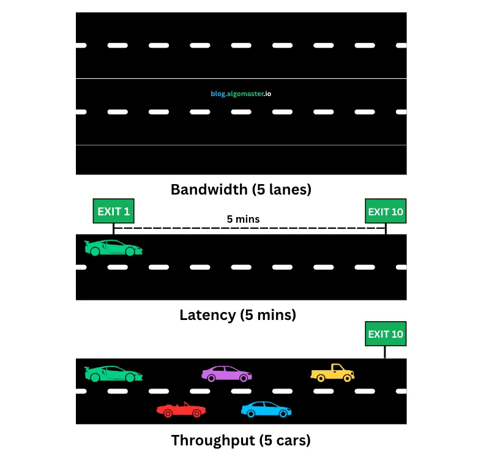

# Latency vs. Throughput vs. Bandwidth



## Table of Contents
- [Overview](#overview)
- [Latency](#latency)
- [Bandwidth](#bandwidth)
- [Throughput](#throughput)
- [Key Differences](#key-differences)
- [Real-World Analogies](#real-world-analogies)
- [How They Work Together](#how-they-work-together)
- [Measurement and Optimization](#measurement-and-optimization)
- [Common Bottlenecks](#common-bottlenecks)
- [Interview Questions](#interview-questions)

---

## Overview

When discussing network and system performance, three fundamental metrics are essential to understand:

- **Latency** - How long it takes for data to travel from source to destination
- **Bandwidth** - Maximum capacity of the data channel
- **Throughput** - Actual amount of data transferred over time

Understanding the difference between these concepts is crucial for:
- Designing scalable systems
- Optimizing application performance
- Diagnosing network issues
- Making architectural decisions
- Interview preparation for system design

---

## Latency

### What is Latency?

**Latency** is the time delay between a request and its response. It measures how long it takes for data to travel from the source to the destination.

**Unit**: Measured in **milliseconds (ms)**, **seconds (s)**, or **microseconds (µs)**

### Key Concepts

- **Low Latency** = Fast response time (better)
- **High Latency** = Slow response time (worse)
- **Round Trip Time (RTT)** = Time for data to go from source to destination and back

### Types of Latency

#### 1. **Network Latency**
Time for a packet to travel across the network

```
Client ──────────────────→ Server
       [Network Latency]
```

**Components:**
- **Propagation Delay** - Time for signal to travel through the medium (cables, fiber)
- **Transmission Delay** - Time to push all packet bits onto the wire
- **Processing Delay** - Time routers/switches take to process packet headers
- **Queuing Delay** - Time packets wait in router queues

#### 2. **Application Latency**
Time application takes to process a request

```
Request → [App Processing] → Response
          [App Latency]
```

#### 3. **Database Latency**
Time to query and retrieve data from database

```
Query → [DB Processing] → Result
        [DB Latency]
```

#### 4. **API Latency**
Time for API endpoint to respond

```
API Call → [API Processing] → Response
           [API Latency]
```

### Latency Formula

```
Total Latency = Propagation Delay + Transmission Delay + 
                Processing Delay + Queuing Delay
```

**Propagation Delay:**
```
Propagation Delay = Distance / Speed of Light in Medium
```

**Example:**
- Distance: 10,000 km (NY to London)
- Speed in fiber: ~200,000 km/s (2/3 speed of light)
- Propagation Delay: 10,000 / 200,000 = **50 ms**

### Real-World Latency Examples

| Scenario | Typical Latency |
|----------|----------------|
| L1 Cache Access | 0.5 ns |
| L2 Cache Access | 7 ns |
| RAM Access | 100 ns |
| SSD Read | 150 µs |
| HDD Disk Seek | 10 ms |
| LAN (same datacenter) | 0.5 - 2 ms |
| Cross-country (US East to West) | 60 - 80 ms |
| Intercontinental (US to Europe) | 100 - 150 ms |
| Intercontinental (US to Asia) | 150 - 300 ms |
| Satellite Connection | 500 - 700 ms |
| Database Query (simple) | 1 - 10 ms |
| Database Query (complex) | 10 - 100+ ms |
| HTTP API Call (local) | 10 - 50 ms |
| HTTP API Call (remote) | 100 - 500+ ms |

### Factors Affecting Latency

1. **Physical Distance** - Farther = Higher latency
2. **Network Hops** - More routers = More processing delays
3. **Network Congestion** - Traffic increases queuing delays
4. **Protocol Overhead** - TCP handshake, TLS negotiation
5. **Server Processing** - Application/database processing time
6. **Bandwidth Limitations** - Can indirectly affect latency

### Latency in Code

#### Measuring Latency (JavaScript)

```javascript
// Simple latency measurement
async function measureLatency(url) {
  const start = performance.now();
  
  try {
    await fetch(url);
    const end = performance.now();
    const latency = end - start;
    
    console.log(`Latency: ${latency.toFixed(2)} ms`);
    return latency;
  } catch (error) {
    console.error('Request failed:', error);
  }
}

// Usage
measureLatency('https://api.example.com/ping');

// More detailed with RTT
async function measureRTT(url) {
  const measurements = [];
  const iterations = 10;
  
  for (let i = 0; i < iterations; i++) {
    const start = performance.now();
    await fetch(url);
    const end = performance.now();
    measurements.push(end - start);
  }
  
  const avgLatency = measurements.reduce((a, b) => a + b) / measurements.length;
  const minLatency = Math.min(...measurements);
  const maxLatency = Math.max(...measurements);
  
  console.log(`Average RTT: ${avgLatency.toFixed(2)} ms`);
  console.log(`Min RTT: ${minLatency.toFixed(2)} ms`);
  console.log(`Max RTT: ${maxLatency.toFixed(2)} ms`);
  
  return { avg: avgLatency, min: minLatency, max: maxLatency };
}
```

#### Node.js Network Latency

```javascript
const https = require('https');

function measureNetworkLatency(hostname) {
  return new Promise((resolve, reject) => {
    const start = Date.now();
    
    const req = https.request({
      hostname: hostname,
      port: 443,
      path: '/',
      method: 'HEAD'
    }, (res) => {
      const latency = Date.now() - start;
      console.log(`Latency to ${hostname}: ${latency} ms`);
      resolve(latency);
    });
    
    req.on('error', reject);
    req.end();
  });
}

// Usage
measureNetworkLatency('www.google.com');
measureNetworkLatency('api.github.com');
```

### Reducing Latency

#### 1. **Use CDN (Content Delivery Network)**
```javascript
// Instead of:


// Use CDN (closer to users):

```

#### 2. **Geographic Distribution**
- Deploy servers in multiple regions
- Route users to nearest server

#### 3. **Caching**
```javascript
// Cache at multiple levels
const cache = new Map();

async function getData(key) {
  // Check memory cache first (0.1ms)
  if (cache.has(key)) {
    return cache.get(key);
  }
  
  // Check Redis cache (1-2ms)
  const redisData = await redisClient.get(key);
  if (redisData) {
    cache.set(key, redisData);
    return redisData;
  }
  
  // Fetch from database (10-50ms)
  const dbData = await db.query(key);
  cache.set(key, dbData);
  await redisClient.set(key, dbData);
  
  return dbData;
}
```

#### 4. **Connection Pooling**
```javascript
// Reuse connections instead of creating new ones
const pool = new Pool({
  host: 'localhost',
  database: 'mydb',
  max: 20, // maximum connections
  idleTimeoutMillis: 30000,
  connectionTimeoutMillis: 2000,
});

// Reusing connection saves TCP handshake time
const client = await pool.connect();
const result = await client.query('SELECT * FROM users');
client.release();
```

#### 5. **Protocol Optimization**
- Use HTTP/2 or HTTP/3 (multiplexing)
- Enable compression (gzip, brotli)
- Minimize HTTP requests

#### 6. **Database Optimization**
```sql
-- Add indexes to reduce query latency
CREATE INDEX idx_user_email ON users(email);

-- Use query optimization
EXPLAIN ANALYZE SELECT * FROM orders WHERE user_id = 123;

-- Use database connection pooling
-- Use read replicas for read-heavy workloads
```

---

## Bandwidth

### What is Bandwidth?

**Bandwidth** is the maximum capacity of a network connection - the theoretical maximum amount of data that can be transmitted over a network in a given time period.

**Unit**: Measured in **bits per second (bps)**, **Mbps**, or **Gbps**

Think of bandwidth as the **width of a pipe** - a wider pipe can carry more water.

### Key Concepts

- **Higher Bandwidth** = More data capacity (like a wider highway)
- **Lower Bandwidth** = Less data capacity (like a narrow road)
- Bandwidth is about **capacity**, not speed

### Common Bandwidth Types

| Connection Type | Typical Bandwidth |
|----------------|-------------------|
| Dial-up | 56 Kbps |
| DSL | 1 - 100 Mbps |
| Cable Internet | 10 - 500 Mbps |
| Fiber Optic | 100 Mbps - 10 Gbps |
| 4G LTE | 5 - 100 Mbps |
| 5G | 100 Mbps - 10 Gbps |
| Ethernet (Fast) | 100 Mbps |
| Ethernet (Gigabit) | 1 Gbps |
| Ethernet (10G) | 10 Gbps |
| Wi-Fi 5 (802.11ac) | 433 Mbps - 1.3 Gbps |
| Wi-Fi 6 (802.11ax) | 600 Mbps - 9.6 Gbps |

### Bandwidth Formula

```
Time to Transfer = File Size / Bandwidth

Example:
- File Size: 100 MB (800 Megabits)
- Bandwidth: 100 Mbps
- Time: 800 Mb / 100 Mbps = 8 seconds
```

### Bandwidth vs File Transfer Time

| File Size | 10 Mbps | 100 Mbps | 1 Gbps |
|-----------|---------|----------|--------|
| 1 MB | 0.8 s | 0.08 s | 0.008 s |
| 10 MB | 8 s | 0.8 s | 0.08 s |
| 100 MB | 80 s | 8 s | 0.8 s |
| 1 GB | 800 s (13 min) | 80 s | 8 s |
| 10 GB | 8000 s (2.2 hrs) | 800 s (13 min) | 80 s |

### Factors Affecting Bandwidth

1. **Network Infrastructure** - Cable quality, router capacity
2. **ISP Plan** - Purchased bandwidth tier
3. **Network Congestion** - Shared bandwidth with other users
4. **Hardware Limitations** - NIC, router, switch capabilities
5. **Protocol Overhead** - Headers reduce effective bandwidth

### Measuring Bandwidth

#### JavaScript Bandwidth Test

```javascript
async function measureBandwidth(url, fileSize) {
  const start = performance.now();
  
  const response = await fetch(url);
  const blob = await response.blob();
  
  const end = performance.now();
  const durationSeconds = (end - start) / 1000;
  
  // Calculate bandwidth in Mbps
  const fileSizeBits = fileSize * 8;
  const bandwidthBps = fileSizeBits / durationSeconds;
  const bandwidthMbps = bandwidthBps / (1024 * 1024);
  
  console.log(`File size: ${fileSize / (1024 * 1024)} MB`);
  console.log(`Duration: ${durationSeconds.toFixed(2)} seconds`);
  console.log(`Bandwidth: ${bandwidthMbps.toFixed(2)} Mbps`);
  
  return bandwidthMbps;
}

// Download a 10MB file to measure bandwidth
measureBandwidth('https://example.com/10mb-file.zip', 10 * 1024 * 1024);
```

#### Node.js Bandwidth Monitoring

```javascript
const https = require('https');

function testDownloadSpeed(url) {
  return new Promise((resolve, reject) => {
    const start = Date.now();
    let downloadedBytes = 0;
    
    https.get(url, (res) => {
      res.on('data', (chunk) => {
        downloadedBytes += chunk.length;
      });
      
      res.on('end', () => {
        const duration = (Date.now() - start) / 1000; // seconds
        const speedMbps = (downloadedBytes * 8) / (duration * 1000000);
        
        console.log(`Downloaded: ${(downloadedBytes / 1024 / 1024).toFixed(2)} MB`);
        console.log(`Time: ${duration.toFixed(2)} seconds`);
        console.log(`Speed: ${speedMbps.toFixed(2)} Mbps`);
        
        resolve(speedMbps);
      });
      
      res.on('error', reject);
    });
  });
}

testDownloadSpeed('https://speed.cloudflare.com/__down?bytes=10000000');
```

### Increasing Bandwidth

1. **Upgrade Internet Plan** - Purchase higher bandwidth tier
2. **Use Wired Connection** - Ethernet instead of Wi-Fi
3. **Upgrade Hardware** - Modern router, NIC
4. **Optimize Network** - Reduce device count, QoS settings
5. **Use Compression** - Reduce data size

```javascript
// Enable compression (reduces bandwidth usage)
const express = require('express');
const compression = require('compression');

const app = express();
app.use(compression()); // gzip compression

app.get('/data', (req, res) => {
  // Large JSON response will be compressed
  res.json({ /* large data */ });
});
```

---

## Throughput

### What is Throughput?

**Throughput** is the actual amount of data successfully transferred over a network in a given time period. It's what you **actually get**, not what you're promised.

**Unit**: Measured in **bits per second (bps)**, **Mbps**, or **Gbps**

### Key Concepts

- **Throughput ≤ Bandwidth** (always)
- Throughput is **actual** data transfer rate
- Affected by latency, packet loss, congestion
- More practical measure than bandwidth

### Bandwidth vs Throughput

```
Bandwidth: Maximum capacity (theoretical)
Throughput: Actual usage (real-world)

Example:
- Bandwidth: 100 Mbps (what your ISP promises)
- Throughput: 85 Mbps (what you actually get)
```

### Factors Affecting Throughput

1. **Network Congestion** - Too many users sharing bandwidth
2. **Packet Loss** - Data needs to be retransmitted
3. **Latency** - High latency can reduce throughput
4. **Protocol Overhead** - Headers, acknowledgments
5. **Hardware Limitations** - CPU, NIC processing power
6. **Application Efficiency** - How well app uses available bandwidth

### Throughput Formula

```
Throughput = Data Transferred / Time Taken

Example:
- Transferred: 500 MB
- Time: 50 seconds
- Throughput: 500 MB / 50s = 10 MB/s = 80 Mbps
```

### Bandwidth-Delay Product (BDP)

The amount of data "in flight" on the network:

```
BDP = Bandwidth × Round Trip Time (RTT)

Example:
- Bandwidth: 100 Mbps
- RTT: 100 ms (0.1 seconds)
- BDP: 100 Mbps × 0.1s = 10 Megabits = 1.25 MB

This means 1.25 MB of data can be in transit at any moment.
```

### Real-World Throughput

| Scenario | Bandwidth | Actual Throughput | Efficiency |
|----------|-----------|-------------------|------------|
| Ideal conditions | 100 Mbps | 95 Mbps | 95% |
| Normal conditions | 100 Mbps | 80-90 Mbps | 80-90% |
| Congested network | 100 Mbps | 40-60 Mbps | 40-60% |
| High packet loss | 100 Mbps | 20-40 Mbps | 20-40% |
| Satellite (high latency) | 100 Mbps | 10-30 Mbps | 10-30% |

### Measuring Throughput

#### JavaScript Throughput Measurement

```javascript
class ThroughputMonitor {
  constructor() {
    this.totalBytes = 0;
    this.startTime = null;
  }
  
  start() {
    this.totalBytes = 0;
    this.startTime = Date.now();
  }
  
  addBytes(bytes) {
    this.totalBytes += bytes;
  }
  
  getCurrentThroughput() {
    const elapsed = (Date.now() - this.startTime) / 1000; // seconds
    const throughputBps = (this.totalBytes * 8) / elapsed;
    const throughputMbps = throughputBps / (1024 * 1024);
    
    return {
      mbps: throughputMbps.toFixed(2),
      mbPerSec: (this.totalBytes / elapsed / (1024 * 1024)).toFixed(2),
      totalMB: (this.totalBytes / (1024 * 1024)).toFixed(2),
      elapsedSec: elapsed.toFixed(2)
    };
  }
}

// Usage
const monitor = new ThroughputMonitor();
monitor.start();

fetch('https://example.com/large-file')
  .then(response => {
    const reader = response.body.getReader();
    
    return new ReadableStream({
      start(controller) {
        function push() {
          reader.read().then(({ done, value }) => {
            if (done) {
              controller.close();
              const stats = monitor.getCurrentThroughput();
              console.log(`Throughput: ${stats.mbps} Mbps`);
              console.log(`Total: ${stats.totalMB} MB in ${stats.elapsedSec}s`);
              return;
            }
            
            monitor.addBytes(value.length);
            controller.enqueue(value);
            
            // Log progress
            const current = monitor.getCurrentThroughput();
            console.log(`Current throughput: ${current.mbps} Mbps`);
            
            push();
          });
        }
        push();
      }
    });
  });
```

#### Real-Time Throughput Dashboard

```javascript
class NetworkMonitor {
  constructor(updateInterval = 1000) {
    this.samples = [];
    this.updateInterval = updateInterval;
    this.lastUpdate = Date.now();
    this.bytesInInterval = 0;
  }
  
  recordBytes(bytes) {
    this.bytesInInterval += bytes;
    
    const now = Date.now();
    if (now - this.lastUpdate >= this.updateInterval) {
      const elapsed = (now - this.lastUpdate) / 1000;
      const throughputMbps = (this.bytesInInterval * 8) / (elapsed * 1000000);
      
      this.samples.push({
        timestamp: now,
        throughput: throughputMbps
      });
      
      // Keep only last 60 samples (1 minute if interval is 1s)
      if (this.samples.length > 60) {
        this.samples.shift();
      }
      
      this.bytesInInterval = 0;
      this.lastUpdate = now;
      
      return throughputMbps;
    }
    
    return null;
  }
  
  getAverageThroughput() {
    if (this.samples.length === 0) return 0;
    
    const sum = this.samples.reduce((acc, s) => acc + s.throughput, 0);
    return (sum / this.samples.length).toFixed(2);
  }
  
  getPeakThroughput() {
    if (this.samples.length === 0) return 0;
    
    return Math.max(...this.samples.map(s => s.throughput)).toFixed(2);
  }
  
  getCurrentThroughput() {
    if (this.samples.length === 0) return 0;
    
    return this.samples[this.samples.length - 1].throughput.toFixed(2);
  }
}

// Usage
const netMonitor = new NetworkMonitor(1000); // Update every second

// When downloading data
fetch('https://example.com/stream')
  .then(response => {
    const reader = response.body.getReader();
    
    function processChunk({ done, value }) {
      if (done) {
        console.log('Download complete!');
        console.log(`Average: ${netMonitor.getAverageThroughput()} Mbps`);
        console.log(`Peak: ${netMonitor.getPeakThroughput()} Mbps`);
        return;
      }
      
      const currentThroughput = netMonitor.recordBytes(value.length);
      if (currentThroughput !== null) {
        console.log(`Throughput: ${currentThroughput.toFixed(2)} Mbps`);
      }
      
      return reader.read().then(processChunk);
    }
    
    return reader.read().then(processChunk);
  });
```

### Improving Throughput

#### 1. **TCP Window Scaling**
```javascript
// Server-side Node.js
const net = require('net');

const server = net.createServer((socket) => {
  // Increase TCP buffer sizes for better throughput
  socket.setNoDelay(true); // Disable Nagle's algorithm
  socket.setKeepAlive(true, 60000);
  
  // Handle data
  socket.on('data', (data) => {
    // Process data
  });
});
```

#### 2. **Parallel Connections**
```javascript
// Download file in parallel chunks
async function parallelDownload(url, chunks = 4) {
  const response = await fetch(url, { method: 'HEAD' });
  const fileSize = parseInt(response.headers.get('content-length'));
  const chunkSize = Math.ceil(fileSize / chunks);
  
  const promises = [];
  
  for (let i = 0; i < chunks; i++) {
    const start = i * chunkSize;
    const end = Math.min(start + chunkSize - 1, fileSize - 1);
    
    promises.push(
      fetch(url, {
        headers: {
          'Range': `bytes=${start}-${end}`
        }
      }).then(res => res.arrayBuffer())
    );
  }
  
  const chunks = await Promise.all(promises);
  
  // Combine chunks
  const blob = new Blob(chunks);
  return blob;
}

parallelDownload('https://example.com/large-file.zip', 4);
```

#### 3. **Compression**
```javascript
// Client-side compression request
fetch('/api/data', {
  headers: {
    'Accept-Encoding': 'gzip, deflate, br'
  }
});

// Server-side (Express)
const compression = require('compression');
app.use(compression({
  level: 6, // Compression level (0-9)
  threshold: 1024 // Only compress if > 1KB
}));
```

#### 4. **HTTP/2 Multiplexing**
```javascript
// Use HTTP/2 for better throughput
const http2 = require('http2');
const fs = require('fs');

const server = http2.createSecureServer({
  key: fs.readFileSync('server.key'),
  cert: fs.readFileSync('server.crt')
});

server.on('stream', (stream, headers) => {
  stream.respond({
    'content-type': 'application/json',
    ':status': 200
  });
  
  stream.end(JSON.stringify({ data: 'response' }));
});

server.listen(443);
```

---

## Key Differences

### Quick Comparison Table

| Aspect | Latency | Bandwidth | Throughput |
|--------|---------|-----------|------------|
| **Definition** | Time delay | Maximum capacity | Actual data rate |
| **Measures** | Time | Capacity | Data volume/time |
| **Unit** | ms, seconds | Mbps, Gbps | Mbps, Gbps |
| **Analogy** | Trip duration | Pipe width | Water flow |
| **Impact** | Responsiveness | Capacity | Performance |
| **Goal** | Minimize (lower is better) | Maximize (higher is better) | Maximize (higher is better) |
| **Affected By** | Distance, hops, processing | Infrastructure, plan | Congestion, loss, latency |
| **Optimization** | CDN, caching, location | Upgrade plan, hardware | Reduce overhead, compression |

### Visual Comparison

```
LATENCY (Time Delay)
Request ────[50ms delay]────→ Response
         Low latency = Fast

BANDWIDTH (Capacity)
══════════════════════════
    Wide pipe = High bandwidth
──────────────────────────
    Narrow pipe = Low bandwidth

THROUGHPUT (Actual Flow)
Request → [Actual: 80 Mbps out of 100 Mbps] → Data
         Real-world performance
```

### Critical Relationships

```
1. Throughput ≤ Bandwidth (always)
   - You can never get more throughput than bandwidth
   - Throughput is limited by bandwidth

2. High Latency + High Bandwidth = Possible
   - Satellite: High bandwidth but high latency (500ms)
   - Like a wide pipe with long distance

3. Low Latency + Low Bandwidth = Possible
   - Nearby server with slow connection
   - Like a narrow pipe with short distance

4. Ideal: Low Latency + High Bandwidth + High Throughput
   - Fast, high-capacity, efficient connection
```

---

## Real-World Analogies

### 1. **Water Pipe Analogy**

```
LATENCY = How long water takes to reach your faucet
- Short pipe = Low latency (fast)
- Long pipe = High latency (slow)

BANDWIDTH = Diameter of the pipe
- Wide pipe = High bandwidth (can carry more)
- Narrow pipe = Low bandwidth (can carry less)

THROUGHPUT = Actual water flow rate
- Clear pipe = High throughput (efficient)
- Clogged pipe = Low throughput (inefficient)
```

**Example:**
- You have a 6-inch pipe (high bandwidth)
- But it's 1000 feet long (high latency)
- And partially clogged (reduced throughput)

### 2. **Highway Analogy**

```
LATENCY = Travel time from A to B
- Distance, traffic lights, speed limits

BANDWIDTH = Number of lanes
- 8-lane highway = High bandwidth
- 2-lane road = Low bandwidth

THROUGHPUT = Cars actually passing per hour
- Free-flowing = High throughput
- Rush hour = Low throughput (despite high bandwidth)
```

### 3. **Restaurant Analogy**

```
LATENCY = Time from order to receiving food
- Fast food = Low latency
- Fine dining = High latency

BANDWIDTH = Kitchen capacity (how many orders they can handle)
- Large kitchen = High bandwidth
- Small kitchen = Low bandwidth

THROUGHPUT = Meals served per hour
- Efficient service = High throughput
- Slow service = Low throughput
```

---

## How They Work Together

### Scenario Analysis

#### Scenario 1: Low Latency, High Bandwidth, High Throughput
**Example**: Local gigabit network

```
Latency: 1-2 ms
Bandwidth: 1 Gbps
Throughput: 950 Mbps

Result: IDEAL - Fast, high capacity, efficient
Use case: Data center, local file transfers
```

#### Scenario 2: High Latency, High Bandwidth, Medium Throughput
**Example**: Satellite internet

```
Latency: 600 ms
Bandwidth: 100 Mbps
Throughput: 60 Mbps

Result: Slow to start, but eventually fast
Use case: Remote areas, maritime
```

#### Scenario 3: Low Latency, Low Bandwidth, Low Throughput
**Example**: Old DSL connection nearby

```
Latency: 20 ms
Bandwidth: 5 Mbps
Throughput: 4 Mbps

Result: Quick responses, but limited capacity
Use case: Basic browsing, email
```

#### Scenario 4: High Latency, Low Bandwidth, Low Throughput
**Example**: Congested mobile network

```
Latency: 200 ms
Bandwidth: 10 Mbps
Throughput: 2 Mbps

Result: WORST - Slow and limited
Use case: Poor mobile coverage
```

### Impact on Applications

```javascript
// Video Streaming
Requirements:
- Bandwidth: HIGH (for quality)
- Latency: MEDIUM (buffering tolerates some delay)
- Throughput: HIGH (consistent data flow)

// Online Gaming
Requirements:
- Bandwidth: LOW-MEDIUM (small data packets)
- Latency: VERY LOW (real-time responses critical)
- Throughput: MEDIUM (consistent but not massive)

// Video Conferencing
Requirements:
- Bandwidth: MEDIUM-HIGH
- Latency: LOW (real-time communication)
- Throughput: HIGH (bidirectional streams)

// File Download
Requirements:
- Bandwidth: HIGH (faster download)
- Latency: LOW-MEDIUM (initial connection)
- Throughput: HIGH (efficient transfer)

// Web Browsing
Requirements:
- Bandwidth: MEDIUM
- Latency: LOW (page responsiveness)
- Throughput: MEDIUM
```

---

## Measurement and Optimization

### Measuring All Three

```javascript
class NetworkMetrics {
  async measureAll(url) {
    const results = {
      latency: null,
      bandwidth: null,
      throughput: null
    };
    
    // Measure Latency (RTT)
    results.latency = await this.measureLatency(url);
    
    // Measure Bandwidth & Throughput
    const { bandwidth, throughput } = await this.measureBandwidthThroughput(url);
    results.bandwidth = bandwidth;
    results.throughput = throughput;
    
    return results;
  }
  
  async measureLatency(url) {
    const measurements = [];
    
    for (let i = 0; i < 10; i++) {
      const start = performance.now();
      await fetch(url, { method: 'HEAD' });
      const latency = performance.now() - start;
      measurements.push(latency);
    }
    
    const avg = measurements.reduce((a, b) => a + b) / measurements.length;
    return avg.toFixed(2);
  }
  
  async measureBandwidthThroughput(testFileUrl) {
    const start = performance.now();
    let totalBytes = 0;
    
    const response = await fetch(testFileUrl);
    const reader = response.body.getReader();
    
    while (true) {
      const { done, value } = await reader.read();
      if (done) break;
      totalBytes += value.length;
    }
    
    const duration = (performance.now() - start) / 1000; // seconds
    
    // Bandwidth (theoretical max based on connection speed tests)
    // This would typically come from ISP specs
    const bandwidth = 100; // Mbps (example)
    
    // Throughput (actual measured)
    const throughputMbps = (totalBytes * 8) / (duration * 1000000);
    
    return {
      bandwidth: bandwidth,
      throughput: throughputMbps.toFixed(2),
      efficiency: ((throughputMbps / bandwidth) * 100).toFixed(2) + '%'
    };
  }
}

// Usage
const metrics = new NetworkMetrics();
metrics.measureAll('https://speed.cloudflare.com/__down?bytes=10000000')
  .then(results => {
    console.log('Network Metrics:');
    console.log(`Latency: ${results.latency} ms`);
    console.log(`Bandwidth: ${results.bandwidth} Mbps`);
    console.log(`Throughput: ${results.throughput} Mbps`);
    console.log(`Efficiency: ${results.efficiency}`);
  });
```

### Optimization Strategies

#### For Latency

```javascript
// 1. Use CDN
const cdnUrl = 'https://cdn.example.com/asset.js';

// 2. DNS Prefetch
<link rel="dns-prefetch" href="//api.example.com">

// 3. Preconnect
<link rel="preconnect" href="//api.example.com">

// 4. HTTP/2 Server Push
// (Server configuration)

// 5. Reduce redirects
// Avoid: http://example.com → https://example.com → https://www.example.com
// Use: Direct to final URL

// 6. Edge computing
// Deploy serverless functions at edge locations
```

#### For Bandwidth

```javascript
// 1. Image optimization


// 2. Lazy loading


// 3. Code splitting
import('./heavy-module.js').then(module => {
  // Use module only when needed
});

// 4. Tree shaking (remove unused code)
// Use ES6 modules and build tools

// 5. Minification
// Webpack, Rollup, esbuild
```

#### For Throughput

```javascript
// 1. Enable compression
// Server: gzip, brotli
// Client: Accept-Encoding header

// 2. HTTP/2 multiplexing
// Single connection, multiple streams

// 3. Optimize TCP settings
const http = require('http');
const server = http.createServer((req, res) => {
  res.setHeader('Connection', 'keep-alive');
  res.setHeader('Keep-Alive', 'timeout=5, max=100');
});

// 4. Batch requests
// Instead of 10 separate API calls, batch into 1

// 5. Use WebSockets for frequent updates
const ws = new WebSocket('wss://example.com');
// More efficient than repeated HTTP requests
```

---

## Common Bottlenecks

### 1. **High Latency Bottleneck**

**Symptoms:**
- Slow initial page load
- Long time to first byte (TTFB)
- Delayed API responses

**Solutions:**
```javascript
// Use CDN for static assets
const assetUrl = 'https://cdn.example.com/app.js';

// Implement caching
const cache = new Map();
async function getCachedData(key) {
  if (cache.has(key)) return cache.get(key);
  const data = await fetchData(key);
  cache.set(key, data);
  return data;
}

// Use connection pooling
// Geographically distribute servers
```

### 2. **Low Bandwidth Bottleneck**

**Symptoms:**
- Large files download slowly
- Video buffering
- Images load slowly

**Solutions:**
```javascript
// Compress assets
// Optimize images (WebP, AVIF)


// Use responsive images
// Lazy load content
// Reduce asset sizes

// Progressive rendering
// Show content as it loads, don't wait for everything
```

### 3. **Low Throughput Bottleneck**

**Symptoms:**
- Transfer starts fast but slows down
- Inconsistent speeds
- Packet loss

**Solutions:**
```javascript
// Implement retry logic with exponential backoff
async function fetchWithRetry(url, maxRetries = 3) {
  for (let i = 0; i < maxRetries; i++) {
    try {
      return await fetch(url);
    } catch (error) {
      if (i === maxRetries - 1) throw error;
      await new Promise(r => setTimeout(r, Math.pow(2, i) * 1000));
    }
  }
}

// Use adaptive bitrate streaming for video
// Reduce concurrent connections
// Optimize TCP window size
```

---

## Interview Questions

### Conceptual Questions

**Q1: What's the difference between latency and throughput?**

**Answer:**
- **Latency** is the time it takes for data to travel from source to destination (measured in milliseconds)
- **Throughput** is the amount of data that can be transferred in a given time period (measured in Mbps/Gbps)
- Example: Latency is how long a package takes to arrive; throughput is how many packages arrive per hour

**Q2: Can you have high bandwidth but low throughput?**

**Answer:**
Yes! This happens when:
- Network congestion reduces actual data flow
- High packet loss requires retransmissions
- Protocol overhead is significant
- Example: 100 Mbps bandwidth but only 40 Mbps throughput due to network congestion

**Q3: How does latency affect throughput?**

**Answer:**
High latency can reduce throughput, especially in TCP connections:
- TCP requires acknowledgment before sending more data
- With high latency, waiting for ACKs reduces effective throughput
- Bandwidth-Delay Product (BDP) = Bandwidth × RTT
- Example: 100 Mbps × 200ms RTT = 20 Megabits "in flight"

**Q4: What's more important for real-time applications: bandwidth or latency?**

**Answer:**
**Latency** is more critical for real-time applications:
- Online gaming: Needs <50ms latency for responsive gameplay
- Video conferencing: Needs <150ms for natural conversation
- VoIP: Needs <150ms for quality calls
- Bandwidth is still important, but latency determines user experience

**Q5: How would you optimize for each metric?**

**Answer:**
```
LATENCY:
- Use CDN for geographic proximity
- Implement caching at multiple levels
- Reduce DNS lookups (prefetch, preconnect)
- Minimize redirects
- Use HTTP/2 or HTTP/3

BANDWIDTH:
- Upgrade internet plan/infrastructure
- Use wired connections instead of wireless
- Upgrade hardware (router, NIC)

THROUGHPUT:
- Enable compression (gzip, brotli)
- Use HTTP/2 multiplexing
- Optimize TCP settings
- Reduce packet loss
- Implement connection pooling
```

### Practical Questions

**Q6: A user reports slow page loads. How would you diagnose if it's a latency or throughput issue?**

**Answer:**
```javascript
// 1. Measure initial connection time (latency)
const start = performance.now();
await fetch(url, { method: 'HEAD' });
const latency = performance.now() - start;
console.log(`Latency: ${latency}ms`);

// 2. Measure actual download (throughput)
const downloadStart = performance.now();
const response = await fetch(url);
await response.blob();
const downloadTime = performance.now() - downloadStart;
console.log(`Download time: ${downloadTime}ms`);

// Analysis:
// - High latency, fast download = Latency issue (far server, many hops)
// - Low latency, slow download = Throughput issue (congestion, low bandwidth)
// - Both high = Multiple issues
```

**Q7: Design a system to serve users globally with minimal latency.**

**Answer:**
```
Architecture:
1. Use CDN (CloudFront, Cloudflare, Fastly)
   - Static assets served from edge locations
   - Users connect to nearest POP

2. Multi-region deployment
   - Deploy app servers in multiple regions
   - US-East, US-West, EU, Asia, etc.

3. Geographic routing
   - Route 53 geolocation routing
   - Direct users to nearest region

4. Caching strategy
   - CDN cache for static assets
   - Redis/Memcached for dynamic data
   - Browser cache with proper headers

5. Database optimization
   - Read replicas in each region
   - Eventually consistent data where possible
   - Use local database for reads
```

**Q8: Calculate transfer time for a 500 MB file over 50 Mbps connection.**

**Answer:**
```
File size: 500 MB = 500 × 8 = 4,000 Megabits
Bandwidth: 50 Mbps
Time = 4,000 Mb / 50 Mbps = 80 seconds

But in reality:
- Protocol overhead reduces effective bandwidth to ~45 Mbps
- Actual time: 4,000 Mb / 45 Mbps ≈ 89 seconds

Plus initial latency:
- If latency is 100ms, add that to start time
- Total: ~89.1 seconds
```

---

## Summary

### Quick Reference

| Metric | Definition | Unit | Goal | Optimization |
|--------|-----------|------|------|--------------|
| **Latency** | Time delay | ms, s | Minimize | CDN, caching, proximity |
| **Bandwidth** | Max capacity | Mbps, Gbps | Maximize | Upgrade plan, hardware |
| **Throughput** | Actual data rate | Mbps, Gbps | Maximize | Compression, optimization |

### Key Takeaways

1. **Latency** = Speed of delivery (how fast)
2. **Bandwidth** = Capacity of pipe (how much it can carry)
3. **Throughput** = Actual flow (what you get)
4. **Throughput ≤ Bandwidth** (always)
5. All three matter for performance
6. Optimize based on your use case:
   - Gaming: Low latency critical
   - Streaming: High throughput needed
   - Downloads: High bandwidth + throughput

### Real-World Impact

```
Fast Website:
✓ Low latency (quick response)
✓ High throughput (efficient data transfer)
✓ Adequate bandwidth (enough capacity)

Slow Website:
✗ High latency (distant server, many hops)
✗ Low throughput (congestion, packet loss)
✗ Low bandwidth (limited capacity)
```

Understanding these metrics enables you to:
- Design better systems
- Diagnose performance issues
- Make informed infrastructure decisions
- Optimize user experience
- Ace system design interviews! 🚀