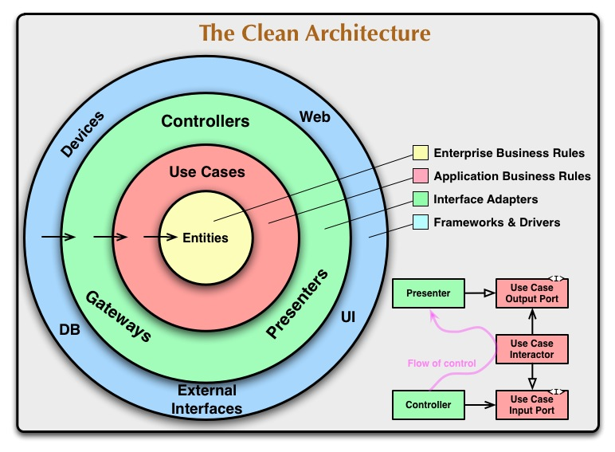
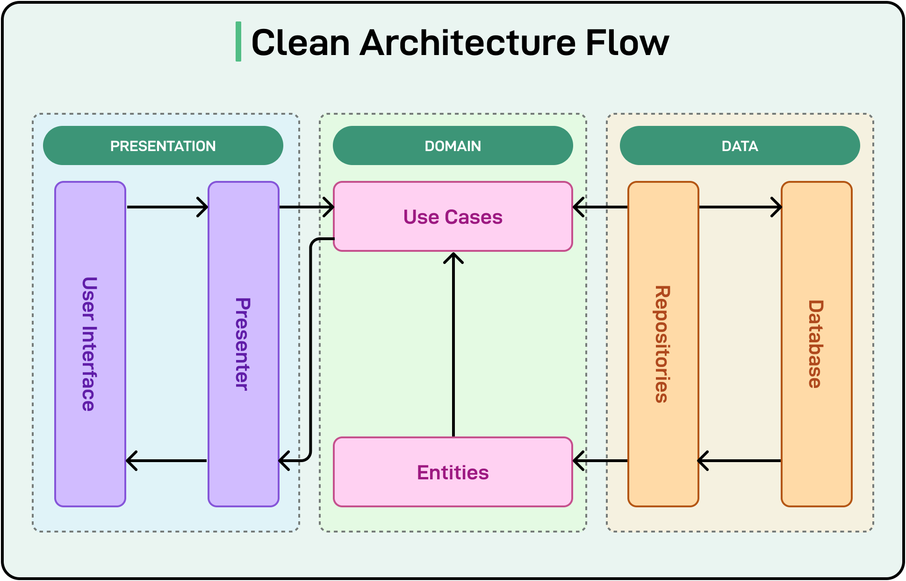
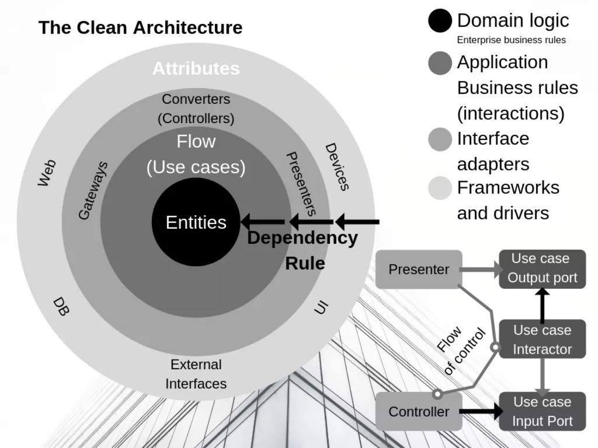

# Clean Code and Clean Architecture: A Practical Guide

Clean code helps people understand individual functions and modules. Clean Architecture helps organize the application so business rules are easier to test and less dependent on a particular database, framework, or user interface.

This folder contains JavaScript and Go examples. Start with the small JavaScript registration flow to understand the boundaries, then explore the larger Go application.

## Start Here

**Before you begin:** Understand functions, objects, imports, and basic asynchronous JavaScript. You do not need to know an architecture framework.

| Your goal | Start with |
| --- | --- |
| Understand the main idea | Read the layer table and request walkthrough below. |
| Follow the JavaScript code | Start at [JS/src/index.js](./JS/src/index.js), then follow its dependencies. |
| Explore the JavaScript notes | Read the [JavaScript guide](./JS/README.md). |
| Explore a Go application | Read the [Go guide](./GO/readme.md) and [presentation walkthrough](./GO/PRESENTATION.md). |

The implementations are learning examples. Use this README to understand their structure; some comments and older examples in the source use “pure” more broadly than its technical meaning.

## Contents

- [One idea to remember](#one-idea-to-remember)
- [The layers and their responsibilities](#the-layers-and-their-responsibilities)
- [Follow a registration request](#follow-a-registration-request)
- [Understand dependency injection](#understand-dependency-injection)
- [Pure functions and side effects](#pure-functions-and-side-effects)
- [What makes the structure useful](#what-makes-the-structure-useful)
- [Read the example with realistic expectations](#read-the-example-with-realistic-expectations)
- [Diagrams](#diagrams)
- [Practice and review](#practice-and-review)

## One Idea to Remember

**Business rules should not need to know which web framework or database you use.**

Consider registering a user. Checking whether a user already exists is part of the registration workflow. Constructing a SQL query is a storage detail. Formatting an HTTP response is a delivery detail.

Separating those responsibilities lets you change one part with fewer changes elsewhere. The boundaries still need compatible contracts and tests; switching databases is not automatically effortless.

### A simple restaurant analogy

A customer places an order through a screen. The screen translates their choices into an order request. The application checks the ordering rules, and a storage component saves the result.

The rule “an order must contain an item” should make sense whether the customer uses a touchscreen, a website, or a command-line tool. Screen layout and database column names should not define that rule.

## The Layers and Their Responsibilities

| Part | Question it answers | In the JavaScript example |
| --- | --- | --- |
| **Entity / domain logic** | What makes a valid user, and what can a user do? | [entities/user.js](./JS/src/entities/user.js) validates user values and provides behavior. |
| **Use case** | What steps make up registration? | [usecases/createUser.js](./JS/src/usecases/createUser.js) checks for duplicates, creates a user, and requests a save. |
| **Repository / gateway adapter** | How do we read and save users? | [gateways/userRepository.js](./JS/src/gateways/userRepository.js) handles storage mapping, caching, and logging. |
| **Delivery / controller** | How does a caller provide input and receive an outcome? | [delivery/userController.js](./JS/src/delivery/userController.js) calls the use case and formats a response object. |
| **Composition root** | Which implementations are connected together? | [index.js](./JS/src/index.js) creates the dependencies and simulates requests. |

A **repository** provides operations such as `getUserByEmail` and `saveUser`. The use case relies on those operations rather than knowing SQL or the database client's API.

A **composition root** is the place where you assemble the application. It can know about both inner business logic and outer implementations because connecting them is its responsibility.

### Dependency direction versus execution order

Clean Architecture's dependency rule concerns what the code knows about. Inner business logic should avoid depending on outer implementation details. Outer adapters may depend on domain code—for example, this repository imports the user entity when mapping stored data.

At runtime, a use case can still call a repository supplied to it. The call goes to an outer implementation, while the use case only knows the required operations. Runtime calls and source-code dependencies are related, but they are not the same diagram.

Entities contain domain rules, not rules that literally never change. Business requirements can change too.

## Follow a Registration Request

The JavaScript entry point builds a request like this:

```javascript
const req = {
  name: 'Alice Johnson',
  email: 'alice@example.com',
  birthYear: 1990,
};
```

Follow it through the application:

1. **The controller receives the request.** It passes the request values to the registration use case.
2. **The use case checks for a duplicate.** It calls `userRepository.getUserByEmail(email)`.
3. **The entity factory validates the user.** It checks the supplied values and constructs a user object.
4. **The use case requests persistence.** It calls `userRepository.saveUser(user)`.
5. **The repository translates and stores the data.** It uses the injected storage implementation and maps the result back to the domain shape.
6. **The controller formats the result.** Success becomes an object with `status: 201`; a caught error becomes an error response.

```text
Request
  -> Controller
  -> Registration use case
       -> Repository: look up existing user
       -> Entity factory: validate and create user
       -> Repository: save user
  -> Controller formats response
  -> Caller receives result
```

This is a simulated request flow. The entry point does not start an HTTP server; it invokes the controller directly with a JavaScript object and logs the response.

## Understand Dependency Injection

**Dependency injection means supplying a collaborator from outside instead of constructing or selecting it inside the business operation.**

The entry point contains this composition:

```javascript
const userRepository = createUserRepository(mockDatabase, mockLogger, mockCache);

const createUserUseCase = createUser({
  userRepository,
  createUserEntity,
});

const registerUser = userController({ createUserUseCase });
```

Read it in three steps:

- Build a repository using the chosen database, logger, and cache.
- Build a use case using that repository and the entity factory.
- Build a controller using that use case.

The `createUser` function returns another function that remembers the supplied dependencies. That remembered access is a **closure**. You configure the dependencies once, then call the returned function with request data.

### Why this helps testing

To test the duplicate-user path, supply a repository whose `getUserByEmail` returns an existing user. To test a successful registration, make it return no match and capture what reaches `saveUser`.

The test can inspect the business behavior without connecting to a real database. Separate integration tests are still needed to verify the real repository and its storage behavior.

## Pure Functions and Side Effects

A **pure function** returns the same result for the same inputs and does not change observable state outside itself. Reading the current time makes a result depend on something beyond the explicit inputs.

| Operation | Pure? | Why |
| --- | --- | --- |
| Validate a name from an input string | Can be | It can depend only on that string. |
| Calculate age from a birth year and an explicitly supplied year | Can be | All required values are inputs. |
| Calculate age using `new Date()` | Not strictly | The result depends on the clock. |
| Save a user to a database or cache | No | It changes external state. |
| Log a message | No | It produces an observable effect. |

The current use case reads `Date.now()` and calls the repository. Some entity methods read the current year. These functions can be understandable and testable without being pure.

Using functions instead of classes does not remove side effects. Injecting a repository makes those effects easier to control; it does not make them disappear. A useful improvement is to pass in a clock or ID generator when tests need deterministic values.

## What Makes the Structure Useful

The architecture is useful when its boundaries reduce the work required to understand, test, or change behavior.

| Change | Main place to start |
| --- | --- |
| Change user validation rules | Entity/domain logic. |
| Add a step to registration | Use case. |
| Change database field names | Repository mapping. |
| Expose the use case through a CLI | A new delivery adapter and composition. |
| Replace a real dependency during a test | Test composition. |

Readable names and focused functions matter inside every layer. Creating more folders does not by itself improve design. Keep abstractions that clarify a real responsibility; a small application may need fewer components.

## Read the Example with Realistic Expectations

The source illustrates boundaries rather than a complete production registration system:

- The entry point uses mock storage, a logger, and an in-memory cache.
- A duplicate lookup followed by a separate save is not enough to prevent concurrent duplicate registrations. A real datastore needs appropriate uniqueness and consistency guarantees.
- `Date.now()` illustrates ID creation but is not a general uniqueness guarantee.
- Birth-year-based age checks are approximate and need stronger input handling for real requirements.
- The controller maps all caught errors to `400`. A real delivery adapter should distinguish invalid input, conflicts, and unexpected server failures.
- `Object.freeze()` prevents direct changes to the returned object's own properties; it does not make all behavior pure or recursively freeze nested objects.

These are useful next improvements after you understand the request flow. They do not require mixing database or HTTP details into the domain rules.

## Diagrams

Use these illustrations after reading the walkthrough. Focus on the responsibilities and boundaries rather than memorizing the number of rings or folders.

### Architecture overview



### Request flow



### Additional architecture illustration



## Practice and Review

Try these small exercises:

1. Trace the sample request from `index.js` to the response and explain each file's role.
2. Change one validation rule and identify which tests should change.
3. Test duplicate registration using a fake repository.
4. Supply an ID generator to make the use case deterministic in a test.
5. Sketch a CLI adapter that calls the existing use case.

Before moving on, answer:

- What is the difference between an entity and a use case?
- Why does the use case receive a repository?
- Why is the registration use case not a pure function?
- What does the composition root know that the business logic should not know?
- Which responsibilities would change if storage moved to another database?

### Additional examples

- [JavaScript guide in this folder](./JS/README.md)
- [Go authentication example](./GO/readme.md)
- [Comments API example repository](https://github.com/dev-mastery/comments-api/tree/master/src)
- [Related video walkthrough](https://www.youtube.com/watch?v=CnailTcJV_U&list=PLcb3YuQNaC-uM1vHqdBP9yOw-hB1IZmAB)

[Back to contents](#contents)
