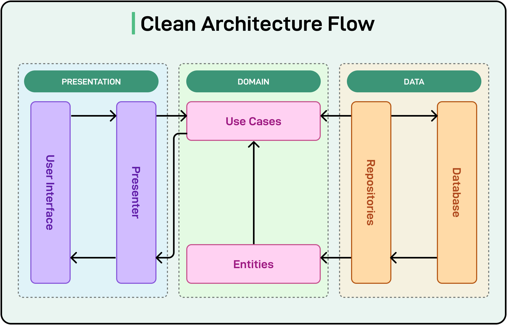
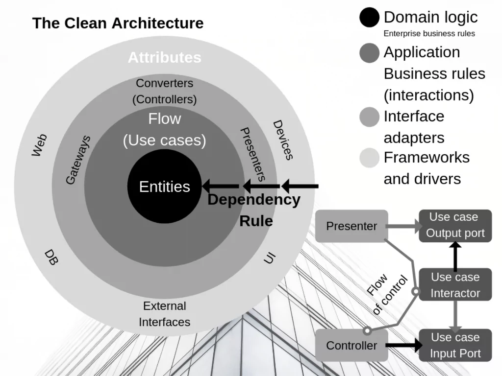

# Clean Code Architecture in JavaScript (Functional Approach)

## Clean Code Architecture Diagram


_Diagram: Replace `architecture.png` with your own architecture diagram image in the project root._


---

## Why is this Project Clean Code?

This project is designed to embody clean code principles by:

- **Separation of Concerns:** Each file and folder has a single, well-defined responsibility. Business logic, data access, and input/output are all separated.
- **Explicit Dependencies:** All dependencies are injected as arguments, making the code easy to test and reason about. No module imports another layer directly except through explicit composition in the entry point.
- **Pure Functions:** Core logic (entities and use cases) is implemented as pure functions, which are predictable and have no side effects.
- **No Framework Lock-in:** The business logic is decoupled from frameworks and infrastructure, so you can swap out delivery mechanisms (e.g., HTTP, CLI) or data storage (e.g., in-memory, database) without changing the core logic.
- **Readability and Maintainability:** The code is modular, easy to follow, and each part can be understood in isolation.

## How the Layers Work and Depend on Each Other

- **Entities:** Contain only domain logic and validation. They do not depend on any other layer.
- **Use Cases:** Contain application-specific business rules. They depend on entities and receive gateways (e.g., repositories) as arguments. They never import or know about delivery mechanisms.
- **Gateways:** Abstract external systems (like databases). They are passed into use cases as dependencies, so the use cases are not tied to any specific implementation.
- **Delivery:** Handles input/output (e.g., API controllers). They depend on use cases, never the other way around. They format requests and responses but do not contain business logic.
- **Composition Root (index.js):** Wires everything together by injecting dependencies. This is the only place where layers are composed.

**Dependency Direction:**

- All dependencies point inward: delivery → use cases → entities.
- Outer layers depend on inner layers, never the reverse.
- This makes the core logic (entities, use cases) independent and reusable.

---



_Diagram: Replace `flow.png` with your own architecture diagram image in the project root._


## Clean Architecture Layers Explained (Ordering Machine Example)

- **Frameworks and Drivers (Outer Layer):**

  - This is where your app talks to the outside world. It could be a touchscreen, a web page, or a payment device.
  - _Example:_ The screen where you tap to order food, or the card reader for payments.

- **Interface Adapters:**

  - These are like translators. They take what the user does (like pressing buttons) and turn it into something the app can use.
  - _Example:_ Code that takes your order from the screen and sends it to the app logic.

- **Application Business Rules / Use Cases:**

  - This is the brain of your app. It decides what happens when you order food, checks your balance, and calculates the total.
  - _Example:_ Logic that checks if you have enough money and processes your order.

- **Enterprise Business Rules / Entities (Core):**
  - These are the most important rules that never change, no matter where the app runs. They are shared across different apps.
  - _Example:_ Rules for what makes a valid order, or how to securely store user info.

_In short: The outside layers handle user actions and devices, the middle layers adapt data, and the inner layers do the real work. Everything depends on the core, but the core depends on nothing else!_

## Running the Example

1. Clone or copy this folder.
2. Run `node src/index.js` to see the user registration flow in action.

---

## References

- [Clean Architecture by Uncle Bob](https://8thlight.com/blog/uncle-bob/2012/08/13/the-clean-architecture.html)
- [Functional Programming in JavaScript](https://eloquentjavascript.net/)

## Example Code for Each Layer

### Entity (src/entities/user.js)

```js
// Pure function for creating a user entity
function createUserEntity({ id, name, email }) {
  if (!name || !email) throw new Error("Name and email are required");
  return Object.freeze({ id, name, email });
}
```

### Use Case (src/usecases/createUser.js)

```js
// Pure function, dependencies injected
function createUser({ userRepository, createUserEntity }) {
  return async function ({ name, email }) {
    if (await userRepository.getUserByEmail(email)) {
      throw new Error("User already exists");
    }
    const user = createUserEntity({ id: Date.now(), name, email });
    return userRepository.saveUser(user);
  };
}
```

### Gateway (src/gateways/userRepository.js)

```js
// In-memory user repository
const users = [];
function saveUser(user) {
  users.push(user);
  return user;
}
function getUserByEmail(email) {
  return users.find((u) => u.email === email) || null;
}
```

### Delivery (src/delivery/userController.js)

```js
// Handles input/output, calls use case
function userController({ createUserUseCase }) {
  return async function registerUser(req) {
    try {
      const user = await createUserUseCase(req);
      return { status: 201, body: user };
    } catch (err) {
      return { status: 400, body: { error: err.message } };
    }
  };
}
```

### Composition Root (src/index.js)

```js
// Wires everything together
const { createUserEntity } = require("./entities/user");
const userRepository = require("./gateways/userRepository");
const { createUser } = require("./usecases/createUser");
const { userController } = require("./delivery/userController");
const createUserUseCase = createUser({ userRepository, createUserEntity });
const registerUser = userController({ createUserUseCase });
```



_Diagram: Replace `cleancode.png` with your own architecture diagram image in the project root._


- [Clean Architecture Example](https://github.com/dev-mastery/comments-api/tree/master/src)
- [Clean Architecture Example Video](https://www.youtube.com/watch?v=CnailTcJV_U&list=PLcb3YuQNaC-uM1vHqdBP9yOw-hB1IZmAB)
